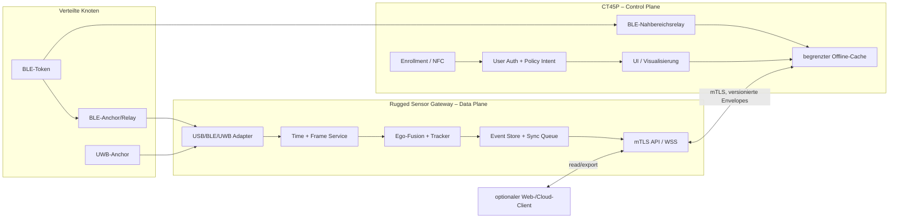

# Alternative Implementierungen der CT45P-Master-Architektur

**Status:** Architekturvergleich und Entscheidungsvorlage<br>
**Stand:** 2026-08-13<br>
**Bezug:** [CT45P-Master-Detailarchitektur](CT45P_MASTER_ARCHITECTURE.md)

## Kurzentscheidung

Für einen belastbaren Feldbetrieb ist nicht die vollständige Ausführung aller
Treiber, Decoder, Fusionen und Server direkt auf Android zu bevorzugen, sondern
eine **geteilte Edge-Architektur**:

- **CT45P:** Control-Plane-Master, Bedienung, NFC/BLE-Nahbereich, Enrollment,
  Autorisierung und mobile Visualisierung.
- **Rugged Sensor Gateway:** Data-Plane-Master für USB-LiDAR, mmWave, externes
  UWB, Zeitabgleich, Fusion, Event Store und lokale API.
- **BLE-/UWB-Anchors:** verteilte Messknoten mit bekannten Positionen.
- **Cloud/Web:** optional; für den Offlinebetrieb nicht erforderlich.

Diese Variante nutzt den vorhandenen Python-Edge-Agent besser aus, entkoppelt
Android-Lifecycle und USB-Sensorbetrieb und verhindert, dass nicht vorhandene
CT45P-Funktionen softwareseitig simuliert werden. Der CT45P bleibt fachlich der
Master für Benutzerintention und Berechtigungen; das Gateway ist autoritativ für
Messzeit, Sensorzustand und Fusion.

---

## 1. Bewerteter Ist-Stand

### 1.1 Aktuelle Laufzeitverteilung

```text
CT45P / Android
  ├─ USB-Serial für LiDAR und mmWave
  ├─ BLE-Scanning
  ├─ Android-IMU
  ├─ Android-UWB-Prototyp
  ├─ lokaler EKF / Offline-Pipeline
  ├─ Room/SQLite
  ├─ einfacher lokaler HTTP-/WebSocket-Server
  └─ WebSocket-Client zum Python-Edge-Agent

Linux/Docker Edge-Agent
  ├─ FastAPI/WebSocket
  ├─ zweiter EKF
  ├─ UWB-DFT
  ├─ ICP/Pipeline
  ├─ SQLite
  └─ MQTT/Web-Visualisierung
```

Damit existieren zwei konkurrierende Orte für Fusion, Persistenz und
Systemzustand. Es ist nicht eindeutig, welcher Zustand nach Verbindungsabbruch,
Reconnect oder Neustart autoritativ ist.

### 1.2 Kritische Implementierungslücken

| Bereich | Beobachtung im Repository | Auswirkung |
|---|---|---|
| Ego-Fusion | Android und `edge-agent/agent.py` schreiben den ersten LiDAR-Punkt bzw. das erste Radarziel in den Pose-EKF | Objektmessung wird fälschlich als Masterpose interpretiert |
| mmWave | `SerialManager.parseMmwaveData()` liefert immer eine leere Liste | kein realer Radar-Datenpfad |
| UWB | Android erzeugt aus Distanz modulo Wellenlänge eine synthetische Phase | keine gemessene Rohphase; DFT-Ergebnis fachlich nicht belastbar |
| BLE-Protokoll | Firmware-/Android-Layout, Company-ID-Behandlung und Mehrbyte-Decoding sind nicht konsistent | Tokenframes werden nicht zuverlässig dekodiert |
| Firmware-Advertising | Advertising wird in der Schleife wiederholt gestartet statt Daten eines laufenden Sets zu aktualisieren | nach dem ersten Start sind Fehler bzw. ausbleibende Updates zu erwarten |
| Zeitsynchronisation | überwiegend Wall-Clock-Empfangszeiten und pauschales 50-ms-Fenster | Uhrsprünge, Serialisierung und verspätete Frames werden nicht korrekt behandelt |
| Netzwerk | hart codiertes `ws://192.168.1.100`, kein Auth-Handshake; bei Disconnect werden Sends verworfen | unsicher und nicht offline-verlustfrei |
| Edge-API | CORS `*`, WebSocket ohne Authentifizierung, globale Singletons für einen Zustand | keine belastbare Mandanten-/Gerätetrennung |
| lokaler HTTP-Server | einfacher `ServerSocket`, Requestbody wird nicht gelesen, CORS `*`, kein TLS/Auth | nur Demo, keine Produktions-Control-Plane |
| Deployment | Edge-Container läuft `privileged`, MQTT-Port ist direkt exponiert | unnötig große Angriffsfläche |
| Datenvertrag | Android-Maps, Pydantic-Modelle und Binärcloud ohne einheitlichen Header | Versions- und Integritätsprobleme |
| Persistenz | Zustände werden doppelt gespeichert; keine transaktionale Sync-Queue | Konflikte und Datenverlust bei Reconnect |

### 1.3 Architekturursache

Das Hauptproblem ist nicht eine einzelne Bibliothek, sondern die Vermischung von
vier Verantwortlichkeiten:

1. physische Sensoraufnahme,
2. deterministische Zeit-/Frame-Verarbeitung,
3. fachliche Fusion und Persistenz,
4. Bedienung und Autorisierung.

Android eignet sich gut für Punkt 4 und ausgewählte lokale Sensoren, ist aber
für dauerhaft verbundene, mehrere USB-Serialgeräte, Hintergrundserver und
präzise kontrollierte Prozesslebenszyklen nur mit erheblichem Zusatzaufwand
einzusetzen.

---

## 2. Bewertungsmaßstab

Bewertet wird von **1 (schwach)** bis **5 (sehr gut)**. Die gewichtete Summe
liegt ebenfalls zwischen 1 und 5.

| Kriterium | Gewicht | Leitfrage |
|---|---:|---|
| Sensor-/I/O-Eignung | 20 % | Lassen sich USB, UWB, Radar und hohe Datenraten robust anbinden? |
| Latenz/Zeitkontrolle | 15 % | Sind monotone Zeit, Puffer und Prozessprioritäten kontrollierbar? |
| Offline-Verfügbarkeit | 15 % | Arbeitet das System ohne Cloud und bei Teilnetzausfall weiter? |
| Security/Isolation | 15 % | Sind Schlüssel, Dienste und Treiber sauber isolierbar? |
| Wartbarkeit | 15 % | Gibt es eine eindeutige Source of Truth und testbare Module? |
| Mobilität/Energie | 10 % | Wie gut bleibt der mobile Einsatz erhalten? |
| Wiederverwendung | 10 % | Wie viel vorhandener Code kann sinnvoll übernommen werden? |

Die Bewertung setzt externe Sensoren voraus. Ohne LiDAR/UWB/Radar kann eine
reine CT45P-App einfacher und angemessener sein.

---

## 3. Option A – Android-Monolith auf dem CT45P

### Aufbau

Alle Adapter, Fusion, DB, lokale API und UI laufen in einer Android-App. Der
Python-Edge-Agent entfällt oder dient nur als optionaler Exportdienst.

```text
Sensoren → Android-UHAL → Android-Fusion → Room → UI/Export
```

### Vorteile

- ein physisches Gerät,
- vollständig mobil und grundsätzlich offline,
- keine lokale Netzwerkabhängigkeit,
- geringe zusätzliche Hardwarekosten,
- Android Keystore und MDM direkt nutzbar.

### Nachteile

- USB-Stromversorgung, mehrere Adapter und Kabel belasten die Mobilität,
- Android-Prozess-/Hintergrundregeln erschweren Dauerbetrieb,
- native SLAM-/Punktwolkenbibliotheken benötigen NDK-Integration,
- externe UWB-/CSI-Funktionen bleiben hardwareabhängig,
- lokaler Server, Sensoraufnahme, Rendering und Fusion konkurrieren um
  thermisches Budget,
- Hardware-in-the-loop-Tests sind eng an CT45P und Android gekoppelt.

### Geeignet für

- Einzelgerät-Demo,
- BLE-/IMU-Grobortung,
- kurze LiDAR-Aufnahmen,
- Anwendungen ohne hohe Dauerlast und ohne verteilte Funkinfrastruktur.

### Nicht empfohlen für

- mehrere kontinuierliche USB-Sensoren,
- RTI/CSI,
- dauerhaftes Multi-Client-Mapping,
- sicherheitskritische Fahrzeugaktionen.

---

## 4. Option B – CT45P als Thin Client, Linux-Gateway als alleiniger Master

### Aufbau

Das Gateway übernimmt Sensoren, Fusion, Datenbank und Policy. Der CT45P ist nur
Bedien- und Anzeigegerät.

```text
Sensoren → Gateway → Fusion/DB/API ⇄ CT45P UI
```

### Vorteile

- klare technische Source of Truth,
- gute USB-/Treiberunterstützung,
- vorhandener Python-Edge-Agent stark wiederverwendbar,
- Android-App wird klein und wartbar,
- Gateway kann ohne CT45P weiter aufzeichnen.

### Nachteile

- Gateway wird auch für Benutzerberechtigungen autoritativ,
- bei Netztrennung kann der CT45P keine lokalen Aktionen ausführen,
- NFC/BLE-Nahbereich des CT45P muss als Remote-Eingang behandelt werden,
- Benutzerintention und Messzustand liegen vollständig auf dem Gateway.

### Bewertung

Technisch solide, aber der CT45P wäre nicht mehr der fachliche Master. Das
widerspricht dem gewünschten Bedien-/Autorisierungsmodell und schafft eine
unnötige Abhängigkeit für mobile Freigaben.

---

## 5. Option C – Geteilte Control-/Data-Plane

### Aufbau

Dies ist die empfohlene Alternative.



### Autoritative Zustände

| Zustandsklasse | Autorität | Replikat |
|---|---|---|
| Benutzeridentität und aktuelle Bedienersitzung | CT45P | kurzlebiger Sessionnachweis am Gateway |
| Bedienerintention/Command | CT45P, signiert | Gateway führt nach Policyprüfung aus |
| Sensormessung und Messzeit | Gateway | CT45P nur Anzeige/Cache |
| Ego-Pose, Tracks und Karte | Gateway | CT45P LOD/State-Stream |
| Geräte-/Fahrzeugpolicy | signierte Fleet-Policy | CT45P und Gateway prüfen unabhängig |
| Audit | beide für eigene Entscheidungen | hash-/ID-korrelierter Export |
| Cloud-Sync | Gateway | CT45P zeigt Status |

Es gibt keinen aktiven Multi-Master für dieselbe Datenklasse. Dadurch entfallen
Konfliktauflösung und „last write wins“ für sicherheitsrelevante Zustände.

### Vorteile

- CT45P bleibt Master für Benutzer und Autorisierung,
- Gateway ist Master für die physikalische Messkette,
- Sensoraufnahme läuft weiter, wenn UI/App beendet wird,
- UI funktioniert weiter mit letztem bestätigten State, wenn Gateway kurz nicht
  erreichbar ist,
- Android- und Linux-Code haben klare Grenzen,
- externe UWB-/RTI-/CSI-Gateways lassen sich ohne Android-Sonderpfad anbinden,
- vorhandene Python-/NumPy-/SciPy-Module können schrittweise gehärtet werden.

### Nachteile

- zusätzliches Gerät, Stromversorgung und Netzwerk,
- Zertifikats-/Enrollmentprozess zwischen CT45P und Gateway erforderlich,
- zwei lokale Auditquellen müssen korreliert werden,
- Offlinebetrieb hat zwei Bedeutungen: ohne Cloud und ohne lokale Gateway-
  Verbindung; beide müssen getrennt spezifiziert werden.

---

## 6. Option D – Deterministischer Sensor-Hub plus CT45P

### Aufbau

Ein Mikrocontroller oder RTOS-Hub übernimmt Sensoraufnahme, Zeitstempel und
Framing; Fusion und UI bleiben auf Android.

```text
LiDAR/Radar/UWB → MCU/RTOS Hub → USB/Ethernet → Android Fusion/UI
```

### Vorteile

- präzise Zeitstempel nahe am Sensor,
- niedriger Strombedarf,
- definierter Boot- und Watchdogpfad,
- kleinerer Angriffs-/Softwareumfang als Linux,
- ein einziges Datenkabel zum CT45P.

### Nachteile

- Punktwolken, SLAM, ICP und dynamische Protokolle sind für kleine MCU-Systeme
  ungeeignet,
- Firmware-, Bootloader- und Hardwareentwicklung kommen hinzu,
- Fusion bleibt im Android-Thermal-/Lifecycle-Budget,
- weniger Wiederverwendung des Python-Edge-Agent,
- Treiberupdates erfordern Firmware-Releases.

### Geeignet für

- fest definierte Sensor-BOM,
- hohe Stückzahlen,
- harte Zeitstempelanforderungen,
- begrenzte Datenraten oder vorgeschaltete FPGA/SoC-Verarbeitung.

Als kurzfristige Alternative ist diese Option zu teuer. Als spätere
Produktoptimierung kann ein Hub das Linux-Gateway bei stabiler Hardware-BOM
ergänzen, nicht zwingend vollständig ersetzen.

---

## 7. Option E – Verteiltes Multi-Master-System

Jeder CT45P/Gateway-Knoten fusioniert lokal; Karten und Tracks werden per Mesh
zusammengeführt.

### Vorteile

- hohe Ausfallsicherheit,
- größere Fläche,
- keine zentrale Messstelle,
- Multi-Perspektiven für BLE/RTI.

### Nachteile

- verteilte Zeit, Map-Frames und Track-IDs sind wesentlich komplexer,
- Konsens ist für Messdaten ungeeignet, CRDTs lösen keine Pose-Unsicherheit,
- Bandbreite und Datenschutz steigen,
- die aktuelle Codebasis hat noch keine belastbare Single-Master-Fusion,
- Security und Revocation müssen auf jedem Knoten konsistent sein.

Diese Option sollte erst nach einer stabilen Option-C-Implementierung beginnen.
Multi-Master ist eine Skalierungsstufe, kein Ersatz für saubere lokale
Verantwortlichkeiten.

---

## 8. Entscheidungsmatrix

| Option | Sensor/I/O 20 % | Zeit 15 % | Offline 15 % | Security 15 % | Wartung 15 % | Mobilität 10 % | Reuse 10 % | Gesamt |
|---|---:|---:|---:|---:|---:|---:|---:|---:|
| A Android-Monolith | 2 | 3 | 5 | 3 | 2 | 5 | 3 | **3,15** |
| B Gateway alleiniger Master | 5 | 4 | 4 | 4 | 5 | 2 | 5 | **4,25** |
| **C Geteilte Control-/Data-Plane** | **5** | **4** | **5** | **5** | **5** | **3** | **5** | **4,65** |
| D MCU-Hub + Android | 4 | 5 | 5 | 5 | 3 | 4 | 2 | **4,10** |
| E Multi-Master | 5 | 3 | 4 | 3 | 2 | 2 | 2 | **3,20** |

### Sensitivität

- Ist **keine Zusatzhardware** erlaubt, gewinnt A trotz technischer Nachteile.
- Ist **harte Sensortaktung** das wichtigste Kriterium, steigt D.
- Ist der CT45P nur Anzeige und muss nicht Autorisierungs-Master bleiben, sind B
  und C technisch fast gleichwertig; B ist etwas einfacher.
- Ist **Flächenabdeckung/Ausfallsicherheit** wichtiger als Entwicklungsrisiko,
  wird E langfristig relevant.

---

## 9. Konkrete Implementierung von Option C

### 9.1 Gateway-Prozesse

Für die erste produktionsnahe Iteration sind getrennte Prozesse sinnvoll:

```text
sensor-ingest
  - USB/BLE/UWB discovery
  - Protokolldecoder, CRC, Größenlimits
  - monotone Zeitstempel
  - SensorEnvelope-Ausgabe

fusion-service
  - Time Alignment
  - Ego-ESKF
  - Objekttracker
  - BLE/UWB-Ortung
  - Map/ICP/Pipeline

state-service
  - SQLite WAL/Event Store
  - Sync Queue
  - Health/Mode
  - Command-Verarbeitung

api-service
  - mTLS HTTPS/WSS
  - Schema-Negotiation
  - LOD/Rate Limit
  - Audit-Korrelation
```

Am Anfang dürfen diese Rollen in einem Python-Paket und Prozess laufen, solange
ihre Module keine globalen Singletons teilen. Prozessaufteilung folgt erst nach
Profiling oder Isolationserfordernis.

### 9.2 Sprachentscheidung

#### Variante C1 – Python-first

- FastAPI/Pydantic für Control-/State-API,
- `asyncio`/`pyserial` für erste Adapter,
- NumPy/SciPy für Fusion/ICP,
- SQLite für Event Store.

**Vorteil:** schnellste Migration und höchste Wiederverwendung.<br>
**Risiko:** Decoder und hohe I/O-Raten benötigen sorgfältige Puffergrenzen;
CPU-intensive Python-Schleifen sind zu vermeiden.

#### Variante C2 – Rust-Ingest plus Python-Fusion

- Rust für USB/BLE, Byteparser, mTLS und Framing,
- Python/NumPy für Algorithmen,
- lokaler Unix-Socket mit längenpräfigiertem CBOR/Protobuf.

**Vorteil:** speichersichere Parser und robuste I/O-Isolation.
**Risiko:** zusätzliche Toolchain, FFI/IPC und doppelte Modellgenerierung.

#### Empfehlung

Mit **C1** beginnen. Parser fuzzing, Größenlimits und Prozessisolation umsetzen.
Nur die tatsächlich durch Messung problematischen Adapter nach Rust verschieben.
Ein vorsorglicher Rewrite würde den fachlich noch falschen Ego-/Objektfilter nur
in einer anderen Sprache reproduzieren.

### 9.3 Android-App

Auf dem CT45P verbleiben:

- Login/Bedienersitzung,
- NFC-Enrollment und Bestätigung des Gateway-Zertifikatfingerprints,
- BLE-Scan für Near-Field-Token, sofern für den Workflow nötig,
- signierte Commands,
- Karten-/Track-Visualisierung,
- lokaler State-/Audit-Cache,
- Health- und Degraded-Anzeige.

Aus dem normalen Produktionspfad entfallen:

- direkte LiDAR-/mmWave-USB-Treiber,
- synthetischer UWB-Pfad,
- zweiter Ego-EKF,
- öffentlich lauschender `ServerSocket`,
- hardcodierte Gateway-IP,
- unpersistierte „send or drop“-Telemetrie.

Ein begrenzter **Standalone-Demomodus** kann die Android-Adapter behalten, muss
aber sichtbar als `DEMO_UNVALIDATED` laufen und darf keine kritischen Commands
freigeben. Die darauf aufbauende native Asset-UI, ihre getrennten
Statusdimensionen sowie die belastbare Distanzsemantik sind in der
[Geräteverwaltung und Interaktionsplattform](DEVICE_MANAGEMENT_PLATFORM.md)
spezifiziert. Zustandsautomat, dauerhafte Events/Outbox, Android-Zustellung und
der ausdrücklich degradierte lokale BLE-Fallback stehen im
[Hintergrund-Abstandsalarm](BACKGROUND_DISTANCE_ALARM.md).

### 9.4 Command-Vertrag

Der CT45P sendet keine direkten „setze Zustand“-Nachrichten, sondern
kurzlebige Intents:

```json
{
  "schema_version": "1.0.0",
  "command_id": "af53da22-9e1f-4440-b154-cd7f3b6773fd",
  "correlation_id": "b734ab4e-1fd9-4f4f-ae94-bf6462662ea7",
  "actor_session_id": "operator-session-17",
  "gateway_id": "gateway-01",
  "resource": "mission/scan",
  "action": "start",
  "expected_revision": 42,
  "issued_at": "2026-08-13T13:04:11Z",
  "expires_at": "2026-08-13T13:04:21Z",
  "parameters": {
    "profile": "architecture"
  },
  "policy_version": "fleet-policy-9",
  "signature": {
    "format": "COSE_SIGN1",
    "algorithm": "ES256",
    "key_id": "ct45p-01-command-key-7",
    "value": "cose-sign1-base64url-value"
  }
}
```

Gateway-Prüfreihenfolge:

1. Schema und Größenlimit,
2. Gateway-Audience,
3. Signatur und Zertifikatsstatus,
4. Session/Actor,
5. Zeitfenster und Replay-ID,
6. `expected_revision`,
7. lokale Capability-/Safety-Policy,
8. transaktionales Audit,
9. Ausführung und idempotentes Ergebnis.

Abgelaufene Commands werden nach Reconnect nicht ausgeführt. Eine Offline-Queue
ist für Daten geeignet, aber nicht automatisch für zeitkritische Aktionen.

### 9.5 Datenpfad

```text
Sensorframe
 → Gateway Adapter
 → SensorEnvelope (monotonic time, integrity, quality)
 → Event Store append
 → Time Aligner
 → Fusion/Tracker
 → State revision N
 → WSS StateDelta/LOD
 → CT45P Cache + Renderer
```

Der Event Store schreibt Rohereignisse abhängig von Retention/Rate. Hochratige
Punktwolken werden chunkweise gespeichert oder bewusst nur als abgeleitete
Keyframes persistiert; sie dürfen nicht als riesige JSON-Arrays durch FastAPI
laufen.

### 9.6 Discovery und Verbindung

Keine fest eingebaute IP-Adresse. Empfohlener Bootstrap:

1. Gateway zeigt QR/NFC-Payload mit Gateway-ID, lokaler URL und
   Zertifikatfingerprint.
2. CT45P prüft Fleet-Signatur des Bootstrap-Payloads.
3. Nutzer bestätigt physische Zuordnung.
4. Beide Seiten führen gegenseitiges Enrollment durch.
5. Spätere Discovery kann über signierte Registry oder lokales DNS erfolgen;
   der Zertifikatfingerprint bleibt maßgeblich.

Bei direktem USB-Ethernet/Tethering bleibt dasselbe mTLS-Protokoll erhalten. Der
Transportwechsel verändert nicht die Identität.

---

## 10. Ausfallverhalten

| Fehler | Gateway-Verhalten | CT45P-Verhalten | Kritische Aktion |
|---|---|---|---|
| CT45P/App weg | laufenden Scan gemäß Lease fortsetzen, lokal speichern | – | keine neue Freigabe |
| Gateway weg | – | letzter State klar als stale, Reconnect | blockiert |
| WLAN weg | weiter messen/persistieren | lokale UI nur mit Cache | neue Commands blockiert oder nur explizite lokale A0/A1-Policy |
| Cloud weg | vollständig lokal weiter | normaler lokaler Betrieb | unverändert |
| USB-Sensor weg | Quelle `DOWN`, Modus neu berechnen | konkrete Degraded-Ursache anzeigen | abhängig von Pflichtquelle |
| DB fast voll | Retention/Backpressure, Audit reservieren | Alarm | neue Rohaufnahme ggf. blockiert |
| Uhrsprung | monotone Verarbeitung fortsetzen, neue Clock-Epoch | UTC-Warnung | zeitgebundene Auth fail-closed, bis Zeit vertrauenswürdig |
| Zertifikat abgelaufen | bestehende Offline-Lease nach Policy | Renewal-Hinweis | A2/A3 blockiert nach Grace |
| Fusion divergiert | State invalid, Rohdaten weiter sichern | `BLOCKED`, keine alte Pose als live | blockiert |

Leases müssen definieren, ob ein Scan nach Verlust des CT45P weiterlaufen darf.
Die Antwort ist missions-/datenschutzabhängig und nicht als globaler Default zu
verstecken.

---

## 11. Security-Architektur der Alternative

### 11.1 Schlüssel

- CT45P-Identität: Android Keystore, Hardware-Sicherheitslevel zur Laufzeit
  prüfen.
- Gateway-Identität: TPM 2.0 oder vergleichbarer nicht exportierbarer
  Schlüsselspeicher; ohne TPM gekennzeichneter reduzierter Modus.
- Token-Identität: gerätespezifischer Schlüssel im Token.
- Fleet Root: offline oder in verwaltetem Provisioningdienst; nicht auf Gateway
  oder CT45P als privater Root-Schlüssel.

### 11.2 Netzwerk

- mTLS für CT45P ↔ Gateway,
- WSS/HTTPS, kein Klartext-`ws://`,
- CORS-Allowlist statt `*`,
- WebSocket-Authentisierung vor Aufnahme in den ConnectionManager,
- Rate Limits und Maximalgrößen je Nachrichtentyp,
- MQTT nur wenn mehrere unabhängige Producer es rechtfertigen; dann ACL,
  TLS und per-Client-Credentials.

Für ein einzelnes Gateway ist MQTT kein Muss. Eine direkte, versionierte WSS-
Verbindung reduziert Betriebs- und Angriffsfläche.

### 11.3 Containergrenze

Der Gateway-Stack sollte nicht als kompletter `privileged`-Container laufen.
Alternativen:

- Adapterdienst auf Host mit spezifischen udev-Rechten; Fusion/API rootless,
- pro Adapter nur das konkrete `/dev`-Device durchreichen,
- read-only Root-Filesystem, Capability-Drop und Ressourcenlimits,
- separater Daten-/Audit-Datenträger.

Ein Container ist keine Security-Grenze, wenn er privilegiert auf Hostgeräte
zugreift.

---

## 12. Daten- und Sync-Modell

### 12.1 Keine bidirektionale Datenbankreplikation

Gateway und CT45P replizieren nicht dieselben Tabellen. Stattdessen:

- Gateway erzeugt monotone `state_revision`.
- CT45P speichert Snapshots/Deltas nur als Cache.
- CT45P erzeugt Commands mit eindeutiger ID.
- Gateway antwortet mit `accepted`, `rejected` oder `completed` und referenziert
  dieselbe Command-ID.
- Auditereignisse beider Seiten verwenden eine gemeinsame Correlation-ID.

### 12.2 Reconnect

```text
CT45P → Hello(last_state_revision, pending_command_ids, schema_versions)
Gateway → Resume(delta_from_revision) | Snapshot(required)
CT45P → CommandStatusQuery(ids)
Gateway → statuses + hashes
```

Wenn Deltas nicht mehr in der Retention liegen, wird ein Snapshot gesendet. Ein
alter Command wird nicht erneut ausgeführt, sondern über seine ID nachgeschlagen.

---

## 13. Repository-Migrationsplan

### Schritt 1 – Autorität festlegen

- `edge-agent` wird Gateway-Data-Plane.
- Android-EKF erhält keinen Produktionsinput mehr.
- Architekturmodus in Konfiguration: `GATEWAY`, `ANDROID_DEMO`, später
  `DISTRIBUTED`.
- Mode wird in Health und UI angezeigt.

### Schritt 2 – Edge-Agent modularisieren

Zielstruktur ohne sofortige Umbenennung des bestehenden Verzeichnisses:

```text
edge-agent/
├── app.py
├── domain/
│   ├── envelopes.py
│   ├── commands.py
│   ├── errors.py
│   └── health.py
├── adapters/
│   ├── base.py
│   ├── usb_lidar.py
│   ├── usb_mmwave.py
│   ├── external_uwb.py
│   └── ble_gateway.py
├── timing/
│   ├── clock.py
│   └── aligner.py
├── fusion/
│   ├── ego.py
│   ├── localization.py
│   └── tracking.py
├── storage/
│   ├── event_store.py
│   ├── sync_queue.py
│   └── audit.py
└── api/
    ├── control.py
    ├── state.py
    └── websocket.py
```

`agent.py` wird Composition Root statt Ort für globale Zustände und gesamte
Fachlogik.

### Schritt 3 – Datenvertrag übernehmen

- Pydantic-Modell aus `docs/contracts/sensor-envelope.schema.json` ableiten oder
  konsistent implementieren.
- Android-Kotlin-Modell mit denselben Golden JSON Fixtures testen.
- Binärheader für Punktwolken definieren.
- alte WebSocket-Nachrichten nur über zeitlich begrenzten Legacy-Adapter
  akzeptieren.

### Schritt 4 – Sensorpfade korrigieren

Priorität:

1. USB-Permission/Reassembly und echter LiDAR-Decoder,
2. vollständiger mmWave-TLV-Decoder,
3. BLE-Firmware-/Decoder-Golden-Vectors,
4. externes UWB mit realem Datenvertrag,
5. SLAM-/Odometry-Pose statt erstem Punkt,
6. Objekttracker statt Radarziel im Ego-EKF.

### Schritt 5 – Android reduzieren

- `AgentWebSocketClient` durch `GatewaySession` mit mTLS, Enrollment,
  State-Revisions und persistenter Command-Outbox ersetzen.
- `SerialManager`, `UwbManager` und `EkfFusion` nur im expliziten Demoflavor
  einbinden.
- `LocalApiServer` aus dem Production-Manifest entfernen.
- Serveradresse aus enrollter Gatewaykonfiguration laden.

### Schritt 6 – Deployment härten

- kein `privileged: true`,
- MQTT entweder entfernen oder TLS/ACL aktivieren,
- CORS-Allowlist,
- Zertifikatsrotation,
- systemd-/Container-Health und Speicheralarme,
- signierte Release-Artefakte.

---

## 14. Aufwand und Risikoprofil

Relative Größen, keine Termin- oder Kostenversprechen:

| Arbeitspaket | Aufwand | Risiko | Begründung |
|---|---:|---:|---|
| Edge-Agent modularisieren | mittel | mittel | vorhandene Logik, aber globale Zustände auflösen |
| SensorEnvelope/Golden Fixtures | klein–mittel | niedrig | Vertrag bereits spezifiziert |
| mTLS Enrollment CT45P/Gateway | mittel–hoch | mittel | Android Keystore, Gateway PKI, Offlinezeit |
| echter LiDAR-/Radar-Decoder | hoch | hoch | gerätespezifische Protokolle und HIL nötig |
| UWB-Integration | hoch | hoch | Hardwareauswahl und Anchor-Infrastruktur offen |
| ESKF/SLAM-Pose | hoch | hoch | fachliche Kernkorrektur, Ground Truth erforderlich |
| Android Thin Client | mittel | niedrig–mittel | vorhandene UI/OkHttp-Basis nutzbar |
| Offline Event Store/Sync | mittel | mittel | Idempotenz und Retention |
| RTI/CSI | sehr hoch | sehr hoch | eigene verteilte Messinfrastruktur |

Die größte Unsicherheit ist nicht die UI, sondern die konkrete Sensorhardware,
Kalibrierung und Ground-Truth-Validierung.

---

## 15. Abnahmekriterien für die Alternative

Option C gilt erst als erfolgreich implementiert, wenn:

1. Gateway arbeitet 8 Stunden ohne CT45P-/Cloud-Verbindung weiter und erzeugt
   einen konsistenten Event Store.
2. CT45P reconnectet ohne doppelte Command-Ausführung und erhält Snapshot oder
   vollständige Deltas.
3. Kein Produktionspfad nutzt ersten LiDAR-Punkt/Radartrack als Ego-Pose.
4. Synthetische UWB-Phase ist im Produktionsbuild nicht erreichbar.
5. BLE-Firmware und Android/Gateway-Decoder bestehen gemeinsame Golden Vectors,
   Replay- und Versionsfehler.
6. Alle CT45P↔Gateway-Verbindungen sind gegenseitig authentifiziert und
   verschlüsselt.
7. Gateway läuft ohne privilegierten Gesamtcontainer.
8. Sensorverlust, DB-voll, Uhrsprung und Fusion-Divergenz erzeugen definierte
   Modi statt plausible Scheinwerte.
9. P50/P95/P99 für Ingest, Fusion und UI-Stream sind unter Last dokumentiert.
10. Hardware-SKU, Firmware, Kalibrierung und Datensatzversion sind im
    Abnahmebericht enthalten.

---

## 16. Empfehlung

### Kurzfristig

**Option C als Python-first Gateway implementieren.** Den vorhandenen
Edge-Agent modularisieren, Android zum authentisierten Control-/Visualisierungs-
Client reduzieren und reale Sensoradapter zuerst stabilisieren. RTI/CSI und
Multi-Master aus dem ersten Produktionsinkrement herauslassen.

### Mittelfristig

Nach gemessenen Engpässen einzelne Decoder in Rust oder auf einen
zeitstempelnden Sensor-Hub verschieben. Fusion in Python/NumPy belassen, solange
Latenz- und Ressourcenmessungen die Zielwerte erfüllen.

### Langfristig

Option E nur als Föderation mehrerer stabiler Option-C-Zellen entwickeln. Jede
Zelle veröffentlicht Pose/Map/Track mit Kovarianz und Framebeziehung; ein
übergeordneter Merger führt Ergebnisse zusammen, ohne lokale Rohsensorpfade zu
verkomplizieren.

Die Alternative ersetzt damit nicht den CT45P, sondern gibt ihm eine klarere,
realistischere Rolle: **mobiler Vertrauens-, Bedien- und Autorisierungsanker**
statt gleichzeitig USB-Hub, Funklabor, SLAM-Rechner, Server und Visualizer zu
sein.
