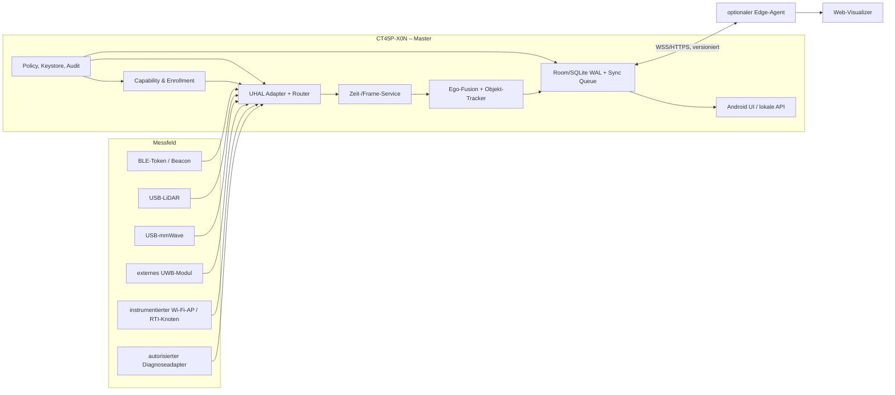
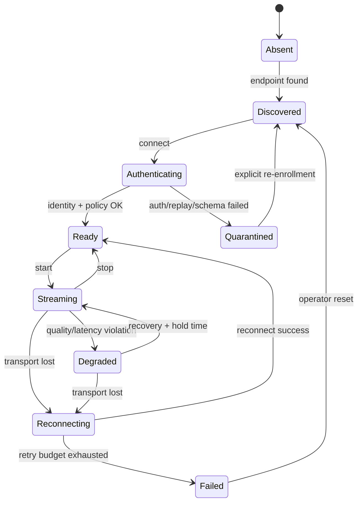
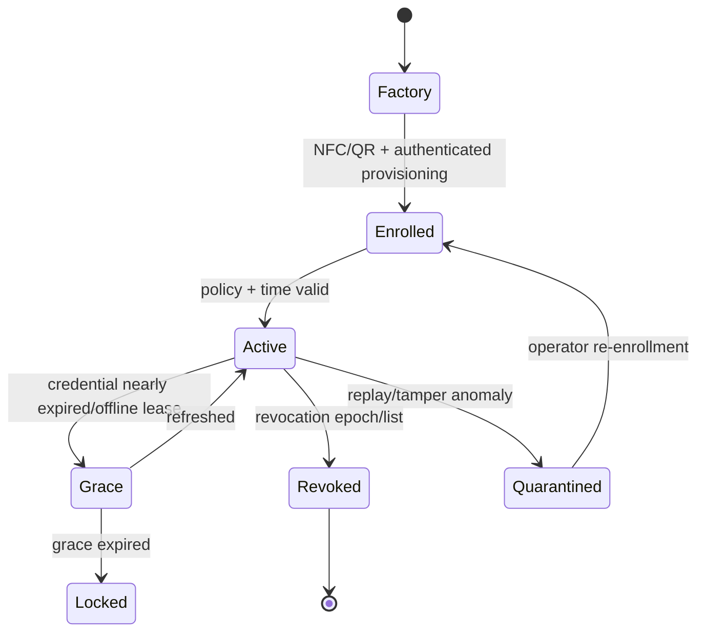
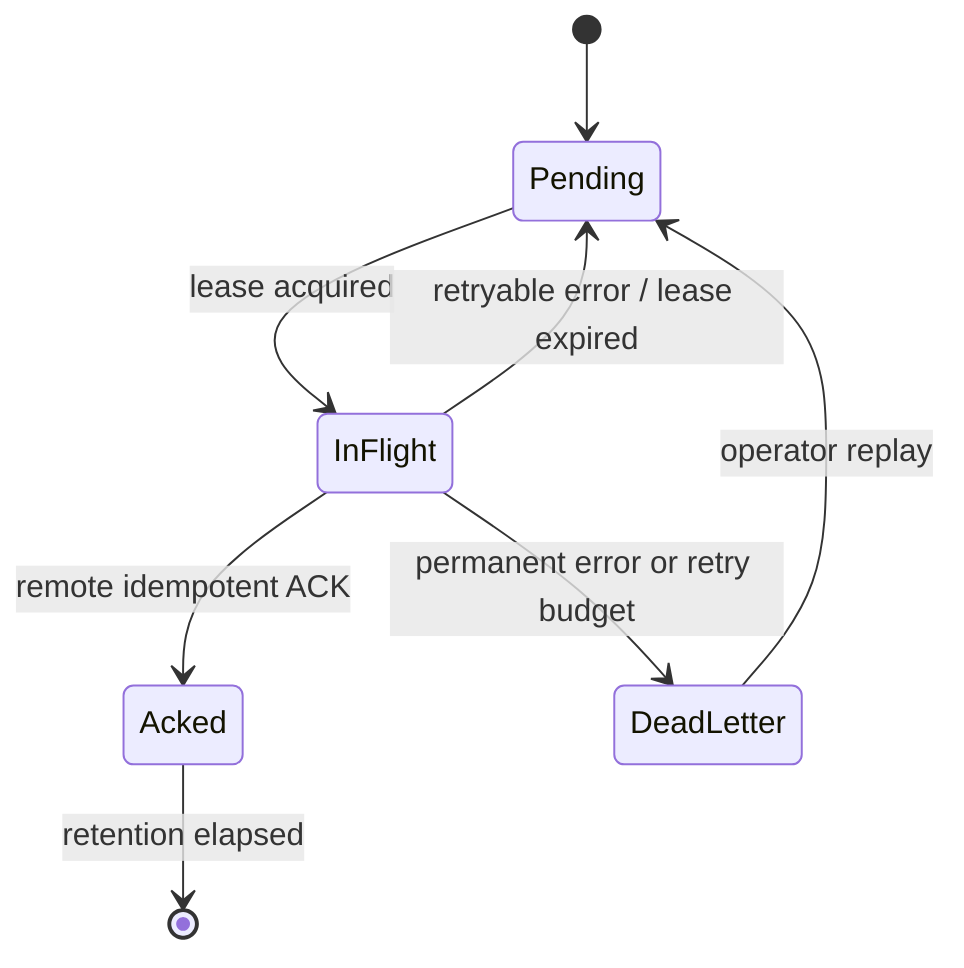

# Honeywell CT45P-X0N als Master-Anchor

## Technische Detailarchitektur für UHAL, Token, Ortung und Sensorfusion

**Dokumentstatus:** Zielarchitektur / Engineering-Spezifikation<br>
**Stand:** 2026-08-13<br>
**Geltungsbereich:** 3dxAgent auf Honeywell CT45 XP, insbesondere WLAN-SKUs der
Baureihe `CT45P-X0N-*`

Eine Gegenüberstellung von Android-Monolith, Linux-Gateway, Sensor-Hub und
Multi-Master einschließlich Entscheidungsmatrix steht unter
[Alternative Implementierungen](ALTERNATIVE_IMPLEMENTATIONS.md). Die darauf
aufbauende native Asset-UI einschließlich Distanzqualität, Alarmen, Enrollment
und sicheren Commands beschreibt die
[Geräteverwaltung und Interaktionsplattform](DEVICE_MANAGEMENT_PLATFORM.md).
Den dauerhaften gatewayautoritativen Alarmzustandsautomaten, seine Outbox sowie
den begrenzten nativen Android-Fallback spezifiziert der
[Hintergrund-Abstandsalarm](BACKGROUND_DISTANCE_ALARM.md). Die gesonderte Prüfung
von ESP32-CSI, X4-Impulsradar, HLK-LD2450, RTL-SDR, Radio-SLAM, SAR und
Hardwareautomation steht im
[RF-Sensor- und Hardwareautomations-Audit](RF_SENSOR_ARCHITECTURE_AUDIT.md).

> **Verbindliche Deployment-Entscheidung:** Für das praktische Produktionsziel gilt
> Option C der Alternativenanalyse: CT45P als Control Plane, Linux-Gateway als
> autoritative Data Plane. CT45P-zentrierte Komponentenbilder in diesem Dokument
> beschreiben die analysierte Monolith-Baseline beziehungsweise logische Fähigkeiten,
> nicht die empfohlene Prozessplatzierung. Bei einem Verteilungskonflikt hat die
> Option-C-Zuordnung Vorrang.

> Dieses Dokument trennt bewusst **belegte Geräteeigenschaften** von
> **3dxAgent-Entwurfszielen**. Begriffe wie UWB, RTI, CSI, SIL, Mesh-Relay oder
> Hardware-Root-of-Trust sind nicht automatisch Eigenschaften des CT45 XP. Wo
> solche Funktionen gebraucht werden, sind externe Hardware, Laufzeitprüfungen,
> Herstellerfreigaben oder eine separate Sicherheitsbewertung erforderlich.

---

## 1. Leseschlüssel und verbindliche Aussagen

Jede wesentliche Aussage gehört zu einer der folgenden Klassen:

| Kürzel | Bedeutung | Darf für die Implementierung angenommen werden? |
|---|---|---|
| **V** | Vom Hersteller oder von einer Plattform-API belegt | Ja, trotzdem pro SKU und zur Laufzeit prüfen |
| **P** | 3dxAgent-Produktentscheidung | Ja, sobald implementiert und getestet |
| **Z** | Zielwert/SLO, noch kein Messwert | Nein; erst nach Abnahmetest als erfüllt markieren |
| **G** | Gate/offene Hardware- oder Compliance-Frage | Nein; Funktion muss bis zur Klärung deaktiviert bleiben |

### 1.1 Verifizierte Gerätebasis

Für die CT45-XP-Familie sind durch Honeywell unter anderem belegt:

- **V:** Qualcomm QCS4290/QCM4290, Octa-Core, 2,0 GHz.
- **V:** CT45 XP mit 6 GB DDR4x RAM und 64 GB UFS-Flash.
- **V:** Bluetooth 5.1/BLE; ein zweites BLE ist für CT45 XP verfügbar.
- **V:** CT45-XP-WLAN-Konfigurationen mit IEEE 802.11ax und 2×2 MU-MIMO.
- **V:** integrierter NFC-Leser für mehrere ISO-/MIFARE-Verfahren.
- **V:** Android, USB-Host/OTG bei entsprechendem SKU/Zubehör und integrierte
  Bewegungssensoren je nach Modellkonfiguration.

Die genaue Bestellnummer muss in einer Beschaffungsmatrix aufgelöst werden.
`CT45P-X0N` beschreibt eine WLAN-Variante; Scanner, Android-Flavor, Akku und
Zubehör ergeben sich erst aus der vollständigen SKU.

### 1.2 Nicht als CT45P-Eigenschaft voraussetzen

| Behauptung | Einordnung | Architekturentscheidung |
|---|---|---|
| Integriertes UWB | **G:** in der öffentlichen CT45-XP-Spezifikation nicht ausgewiesen | Externes UWB-Modul über USB/BLE/Wi-Fi oder anderes Mastergerät einsetzen |
| Rohes Wi-Fi-CSI | **G:** normale Android-Wi-Fi-APIs liefern kein vollständiges CSI | Instrumentierten AP/NIC als externen Sensor verwenden |
| BLE AoA/AoD | **G:** benötigt Antennenarray und Controller-/SDK-Unterstützung | Nicht aus „Bluetooth 5.1“ ableiten; Hardwaretest erforderlich |
| Zweites BLE als frei programmierbarer Controller | **G:** primär für Geräteortung beworben | Nur über dokumentiertes Honeywell-SDK nutzen |
| Dediziertes BLE-Mesh-Relay | **G:** nicht aus Datenblatt ableitbar | Als separates nRF52-Relay planen |
| Konfigurierbares TX-Power-Fenster oder konkrete Empfindlichkeit | **G:** keine CT45P-Garantie | Zur Laufzeit messen, Controller-Fähigkeiten abfragen |
| Zentimetergenaue Ortung | **Z:** nur mit kalibrierter UWB-Infrastruktur realistisch | BLE-RSSI nur als Grobortung behandeln |
| Erkennung „durch Wände“ | **Z/G:** benötigt verteilte RTI-/Radar-Infrastruktur | Nie als alleinige CT45P-Funktion bewerben |
| SIL 1–4 eines Tokens | Fachlich falsch als Gerätemerkmal | SIL nur für eine bewertete Sicherheitsfunktion des Gesamtsystems beanspruchen |

### 1.3 Startfähigkeitsprüfung

Der Master aktiviert keinen Adapter allein anhand des Produktnamens. Beim Start
wird ein signierter `CapabilityReport` erzeugt:

```text
hardware/SKU-Konfiguration
  ├─ PackageManager.hasSystemFeature(...)
  ├─ BluetoothAdapter: BLE, Coded PHY, Extended/Periodic Advertising
  ├─ UsbManager.deviceList + erteilte USB-Berechtigungen
  ├─ SensorManager: IMU-Sensortypen, Rate, Auflösung
  ├─ ConnectivityManager: WLAN/Mobilfunk/Ethernet
  ├─ UWB-Feature/API: vorhanden und funktionsfähig?
  ├─ Android Keystore: SecurityLevel und Key-Attestation
  └─ App-/Firmware-/Schema-Versionen
```

Ein fehlendes Pflichtmerkmal führt zu `BLOCKED`; ein fehlendes optionales
Merkmal zu `DEGRADED`. Ein bloß vorhandenes Android-Feature beweist noch keine
Messqualität.

---

## 2. Systemgrenze und Verantwortlichkeiten

### 2.1 Rolle des Masters

„Master“ bezeichnet hier die fachliche Orchestrierung, nicht die Konzentration aller
Laufzeitfunktionen in einem Android-Prozess. Die analysierte Monolith-Baseline würde dem
CT45P Geräteerkennung, UHAL-Normalisierung, Zeit-/Frame-Koordination, Fusion,
Persistenz, Bedienung und Export zuordnen. Diese Verteilung ist **nicht** die
Produktions-Empfehlung.

In der verbindlichen Option-C-Zielverteilung übernimmt der CT45P:

1. Operatorsitzung, Enrollment und Bestätigung von Gerätebindung,
2. signierte Benutzerintentionen und Policy-Kommandos,
3. lokale, klar als Cache gekennzeichnete Projektionen,
4. Bedienung, Notification-Darstellung und Degradationsanzeige.

Das Linux-Gateway übernimmt dagegen Messadapter, UHAL-Normalisierung,
Zeit-/Frame-Koordination, Qualitätsbewertung, Fusion, autoritative Persistenz,
Alarmzustand und Event-/Delivery-Outbox. Damit bleibt der CT45P mobiler Vertrauens- und
Bedienanker, ist aber nicht automatisch physikalischer Funk-Anchor oder Data-Plane-
Master.

Ein **physikalischer Anchor** ist dagegen ein Knoten mit bekannter Position im
Kartenkoordinatensystem. Ein bewegter CT45P kann Master sein, ohne Anchor zu
sein. Für BLE-/UWB-Multilateration müssen diese Begriffe getrennt bleiben.

### 2.2 Kontextdiagramm der Monolith-Baseline

Das folgende Diagramm hält Option A als Vergleichs- und Schnittstellenreferenz fest. Das
empfohlene Option-C-Deployment verschiebt `UHAL`, `TIME`, `FUSION`, autoritativen
`STORE` und Data-Plane-`POLICY` in das Linux-Gateway; sein verbindliches Diagramm steht
in der [Alternativenanalyse](ALTERNATIVE_IMPLEMENTATIONS.md#5-option-c--geteilte-control-data-plane).



### 2.3 Trust-Zonen

| Zone | Beispiele | Vertrauensniveau | Zulässige Daten |
|---|---|---:|---|
| Z0 | Android Keystore/TEE, Token-Schlüsselspeicher | sehr hoch, nach Attestation | Schlüsseloperationen, nie Rohschlüssel exportieren |
| Z1 | signierte Master-App, lokale DB | hoch | normalisierte Messungen, Policy, Queue |
| Z2 | enrolter BLE-/USB-Client | mittel | nur erlaubte Sensortypen und Raten |
| Z3 | lokales WLAN/MQTT | nicht vertrauenswürdig | ausschließlich authentifiziert und verschlüsselt |
| Z4 | Cloud/Edge/Webclient | extern | minimierte, zweckgebundene Daten |

USB ist wegen der Kabelverbindung **nicht automatisch vertrauenswürdig**.
Vendor-ID/Product-ID dienen nur der Treiberauswahl, nicht der Authentifizierung.

---

## 3. UHAL – Universal Hardware Abstraction Layer

### 3.1 Schichten

```text
Android/Honeywell APIs, USB-Treiber, BLE GATT, Socket, NFC
                         │
                Transport-Adapter
                         │
         Decoder + Protokollversionierung
                         │
        SensorEnvelope + Quality/Covariance
                         │
       UHAL Router / Redundanz / Backpressure
                         │
     Time Alignment → Fusion → Storage/Export
```

Die UHAL abstrahiert **Transport**, nicht Sensorbedeutung. Ein BLE-BMS und ein
USB-BMS können redundant sein; ein USB-LiDAR und ein BLE-Token sind es nicht.
Eine pauschale Regel `USB > BLE` darf deshalb nur innerhalb derselben
`logicalStreamId` angewendet werden.

### 3.2 Kerninterface

Referenzform in Kotlin:

```kotlin
interface UhalAdapter {
    val adapterId: String
    val transport: Transport
    val capabilities: Set<Capability>
    val state: StateFlow<AdapterState>
    val frames: Flow<SensorEnvelope>

    suspend fun discover(): List<EndpointDescriptor>
    suspend fun connect(endpoint: EndpointDescriptor, credentialRef: String?)
    suspend fun configure(config: AdapterConfig)
    suspend fun start()
    suspend fun stop(reason: StopReason)
    suspend fun health(): AdapterHealth
}
```

Verbindliche Regeln:

- `connect()` ist idempotent.
- `start()` ist nur aus `READY` zulässig.
- Jeder Adapter beendet eigene Coroutines, Deskriptoren und USB-Claims in
  `stop()`.
- Exceptions verlassen den Adapter nicht unklassifiziert; sie werden als
  `UhalError(category, retryable, detailCode)` gemeldet.
- Rohdaten dürfen optional separat aufgezeichnet werden, erreichen die Fusion
  aber nur nach erfolgreichem Decode, Plausibilitätscheck und Policy-Prüfung.

### 3.3 Zustandsautomat eines Adapters



### 3.4 Einheitlicher Datenvertrag

Jede Messung wird in einen `SensorEnvelope` überführt. Die maschinenlesbare
Fassung liegt unter
[`contracts/sensor-envelope.schema.json`](contracts/sensor-envelope.schema.json).

Pflichtfelder:

| Feld | Semantik |
|---|---|
| `schema_version` | SemVer des Envelope-Schemas |
| `event_id` | UUID; bleibt bei Retries unverändert |
| `logical_stream_id` | fachlicher Stream, z. B. `vehicle-17/bms/soc` |
| `source` | Master, Endpoint, Adapter und Transport |
| `kind` | z. B. `imu.sample`, `ble.observation`, `lidar.cloud` |
| `sequence` | monotone Sequenz pro Boot/Session |
| `observed_monotonic_ns` | lokale monotone Empfangs-/Messzeit |
| `observed_at` | UTC für Anzeige/Korrelation, nicht für Filter-`dt` |
| `frame_id` | Koordinatenframe der Messung |
| `quality` | Konfidenz, Latenz, Kovarianz, Flags |
| `payload` | versionsgebundene Nutzdaten |
| `integrity` | Verifikationsstatus und Schlüsselreferenz, nie Schlüsselmaterial |

Beispiel:

```json
{
  "schema_version": "1.0.0",
  "event_id": "1b289c32-e27a-4ee5-8140-dc3b064821fb",
  "logical_stream_id": "token-7/ble/observation",
  "kind": "ble.observation",
  "sequence": 4181,
  "observed_monotonic_ns": 784441230019,
  "observed_at": "2026-08-13T12:42:31.772Z",
  "frame_id": "ct45p_ble_antenna",
  "source": {
    "master_id": "ct45p-01",
    "endpoint_id": "token-7",
    "adapter_id": "android-ble-primary",
    "transport": "BLE"
  },
  "quality": {
    "confidence": 0.72,
    "latency_ms": 18.4,
    "covariance_diagonal": [16.0],
    "flags": ["NLOS_POSSIBLE"]
  },
  "payload": {
    "rssi_dbm": -71,
    "tx_power_dbm": -8,
    "channel": null,
    "battery_percent": 83
  },
  "integrity": {
    "verified": true,
    "algorithm": "AES-CMAC-64",
    "key_id": "token-7-k3"
  }
}
```

### 3.5 Zeitmodell

`System.currentTimeMillis()` darf nicht alleinige Filterzeit sein, weil die Uhr
springen kann. Intern gilt:

- `t_mono`: `elapsedRealtimeNanos()` bzw. Sensor-Hardwarezeit; bestimmt `dt`.
- `t_utc`: synchronisierte UTC; dient Audit, Export und Multi-Master-Korrelation.
- `clock_epoch`: wird erhöht, wenn eine Uhrkorrektur oder ein Geräteboot erkannt
  wird.
- `uncertainty_ns`: Unsicherheit der Abbildung `t_utc = a·t_mono + b`.

Für USB ohne Hardwarezeit wird beim Empfang gestempelt und die bekannte
Serialisierungsdauer als Unsicherheit addiert. Für Pakete mit Sensorzeit wird
ein robuster Offset-/Drift-Schätzer geführt. Ein Frame wird nicht nur deshalb
„synchron“, weil zwei Empfangszeitpunkte weniger als 50 ms auseinanderliegen.

### 3.6 Router, Failover und Deduplizierung

Für jede `logical_stream_id` berechnet der Router je Quelle:

```text
score = 0.30·availability
      + 0.25·data_quality
      + 0.20·freshness
      + 0.15·integrity
      + 0.10·energy_fit
      - transport_cost
```

Harte Ausschlüsse schlagen den Score:

1. Identität/Tag/Signatur ungültig,
2. Sequenzwiederholung außerhalb des Reorder-Fensters,
3. Schema inkompatibel,
4. Messung außerhalb physikalischer Grenzen,
5. Quelle laut Policy für diesen Stream nicht autorisiert.

Failover-Ablauf:

```text
ACTIVE
  ├─ 3 aufeinanderfolgende Deadline-Verletzungen → SUSPECT
  ├─ Alternative mindestens 500 ms stabil → SWITCH_PENDING
  ├─ Frame-Grenze + Zustandsübernahme → ACTIVE(alternative)
  └─ alte Quelle 5 s als SHADOW; kein sofortiges Zurückspringen
```

`< 200 ms` ist ein **Zielwert**, keine garantierte Eigenschaft. Er ist nur bei
vorverbundener, bereits authentifizierter Alternative realistisch. Kaltstart,
BLE-GATT-Aufbau oder USB-Neuenumeration können deutlich länger dauern.

Deduplizierungsschlüssel:

```text
(source.endpoint_id, boot_id, sequence, payload_hash)
```

Zeitstempel allein sind ungeeignet: zwei echte Messungen können dieselbe
Millisekunde haben, und dieselbe Messung kann auf zwei Wegen andere
Empfangszeiten erhalten.

### 3.7 Backpressure

| Datenklasse | Strategie | Begründung |
|---|---|---|
| IMU | begrenzter Ringpuffer; für Propagation keine Samples still verwerfen | Reihenfolge ist kritisch |
| Punktwolke | „latest complete frame“, LOD/Downsampling | alte Clouds erhöhen nur Latenz |
| Alarm/Audit | persistente Queue, niemals `DROP_OLDEST` | Nachweisbarkeit |
| BLE-Observation | pro Endpoint jüngsten Wert halten, Rohfenster für Filter | Burst-Scans begrenzen |
| Video | separat, rate-adaptiv; nicht durch allgemeinen Eventbus kopieren | Speicher- und GC-Druck |

---

## 4. Adapter im Detail

### 4.1 BLE

**Aufgaben:** gefiltertes Scanning, Enrollment, GATT-Sessions, Observation-
Normalisierung, Replay-Schutz und Koexistenzmanagement.

Android 12+ verlangt je nach Operation `BLUETOOTH_SCAN`,
`BLUETOOTH_CONNECT` und `BLUETOOTH_ADVERTISE` als Laufzeitberechtigungen. Da
das System RSSI zur physischen Lokalisierung nutzt, darf
`neverForLocation` nicht fälschlich gesetzt werden; die Standort-/Datenschutz-
Berechtigung muss zum tatsächlichen Zweck passen.

Scanprofil:

| Modus | Scan | Token-Advertising | Einsatz |
|---|---:|---:|---|
| Discovery | kurze Low-Latency-Fenster | 100–250 ms | Aufnahme/Fehlersuche |
| Tracking | balancierte Duty-Cycles | 250–1000 ms adaptiv | Normalbetrieb |
| Energy Save | Batch-/Low-Power | 1–5 s | statische Assets |
| Emergency | projektspezifisch | schnell, zeitlich begrenzt | nur Policy-gesteuert |

MAC-Adressen sind wegen BLE Private Addresses keine stabile Identität. Die
Identität kommt aus enrolltem Credential/rotierender EID, nicht aus `mac`.

### 4.2 USB-C/OTG

Ablauf:

1. `UsbManager` enumeriert Geräte.
2. Match gegen erlaubte VID/PID **und** Interface-Klasse/Protokoll.
3. Nutzer-/Device-Owner-Berechtigung einholen.
4. Endpoints claimen und exakte Framing-Spezifikation aktivieren.
5. Read-Loop mit Teilframepuffer, CRC und Größenlimit starten.
6. Bei Detach: Reads abbrechen, Interface freigeben, Deskriptor schließen.

Der aktuelle `SerialManager` ist ein Prototyp. Für Produktion fehlen unter
anderem robuste Paket-Reassemblierung über beliebige USB-Chunks, CRC-Prüfung,
explizite USB-Permission, ein vollständiger TI-TLV-Decoder und ein Schutz gegen
rekursive Watchdog-Neuinitialisierung.

### 4.3 Wi-Fi

Wi-Fi transportiert normalisierte Events über WSS/HTTPS oder MQTTS. Der
Transport nutzt:

- TLS 1.3 bevorzugt, TLS 1.2 nur als kontrollierter Fallback,
- mTLS für verwaltete Gateways,
- Zertifikatrotation und Zeitvalidierung trotz Offline-Phasen,
- Ping/Pong und anwendungsseitige Sequenznummern,
- keine Klartext-Broker-Credentials im APK oder Clientmodell.

Wi-Fi 6 verbessert Kapazität in geeigneter Infrastruktur, garantiert aber weder
Latenz noch deterministisches Failover. OFDMA, TWT und MU-MIMO werden vom AP,
Clienttreiber und Netzdesign gemeinsam bestimmt.

### 4.4 NFC

NFC ist Bootstrap-/Presence-Kanal, kein Dauer-Sensorstream:

- Token-/Fahrzeug-ID lesen,
- Enrollment-Challenge übertragen,
- Public-Key-Fingerprint bestätigen,
- Bediener-Presence für kritische Freigaben nachweisen.

Ein NFC-Tag allein ist kopierbar, wenn er keine kryptografische Challenge-
Response-Funktion besitzt.

### 4.5 Externes UWB

Der Adapter wird nur aktiviert, wenn die komplette Kette vorhanden ist:

```text
UWB-Radio/Anchor ↔ freigegebenes Protokoll ↔ USB/BLE/Wi-Fi ↔ UHAL-UWB-Adapter
```

Ein Android-UWB-API-Aufruf erzeugt keine UWB-Hardware. Distanzwerte dürfen
nicht künstlich modulo einer angenommenen Wellenlänge in „Rohphase“ umgerechnet
und anschließend als gemessener Micro-Doppler behandelt werden. Der bestehende
`UwbManager.extractPhase()` ist deshalb ausschließlich ein Platzhalter, nicht
für Vitalzeichen- oder Sicherheitsentscheidungen geeignet.

---

## 5. BLE-Akku-Token und Autorisierung

### 5.1 Drei getrennte Objekte

1. **Honeywell Smart Battery / zweites BLE:** Geräteeigenschaft des CT45 XP;
   nicht automatisch 3dxAgent-Autorisierungstoken.
2. **3dxAgent BLE-Token:** externes nRF52-Gerät mit eigener Identität,
   Telemetrie und optionaler Akku-/Fahrzeugbindung.
3. **Autorisierungsnachweis:** signierte, zeitlich begrenzte Claims. Er kann im
   Token gespeichert sein, ist aber logisch nicht der Akku selbst.

Diese Trennung verhindert, dass der bloße Besitz eines austauschbaren Akkus
unbegrenzt Rechte verleiht.

### 5.2 Claims

Die maschinenlesbare Form liegt unter
[`contracts/hardware-token.schema.json`](contracts/hardware-token.schema.json).
Wesentliche Claims:

```kotlin
data class HardwareTokenClaims(
    val tokenId: String,
    val issuer: String,
    val subjectHardwareId: String,
    val audienceMasterId: String,
    val vehicleId: String?,
    val issuedAt: Instant,
    val notBefore: Instant,
    val expiresAt: Instant,
    val role: Role,
    val permissions: Set<String>,
    val tokenType: TokenType,
    val meshMembers: Set<String>,
    val keyId: String,
    val tokenVersion: Int,
    val revocationEpoch: Long,
)
```

Nicht in Claims gehören private Schlüssel, Seed-Key-Algorithmen,
Klartext-API-Keys oder ein behauptetes `SIL`.

### 5.3 Kryptografisches Modell

`SHA-256` ist eine Hashfunktion, keine Signatur. Das Zielmodell lautet:

```text
Enrollment CA / Fleet Root
  ├─ signiert Master-Geräteidentität
  ├─ signiert Token-Geräteidentität
  └─ signiert Autorisierungspolicy

Master- und Token-Schlüssel
  ├─ statischer Identitätsschlüssel (nicht exportierbar)
  ├─ ephemerer ECDH-Schlüssel je Session
  └─ HKDF-SHA-256 → getrennte TX-, RX- und EID-Schlüssel
```

Empfohlene Bausteine:

- Enrollment-Credential: COSE_Sign1 mit ECDSA P-256 oder Ed25519, abhängig von
  der tatsächlich verfügbaren Hardwareunterstützung.
- GATT-/Transportpayload: AES-256-GCM mit eindeutigem 96-Bit-Nonce.
- Kurzes Advertising: rotierende EID plus Sequenz und authentifizierender Tag,
  z. B. AES-CMAC-64. Die Kürzung ist eine bewusste Sicherheits-/Platzabwägung.
- Schlüsselableitung: HKDF-SHA-256 mit Protokollversion, beiden Identitäten und
  Session-Nonce als Kontext.

Für GCM ist **Nonce-Eindeutigkeit pro Schlüssel** zwingend. Ein rein zufälliger
96-Bit-IV ist möglich, aber ein strukturierter Nonce ist besser überprüfbar:

```text
nonce = session_salt_32 || packet_sequence_64
```

Bei Reboot muss entweder ein neuer Session-Key entstehen oder ein
nichtflüchtiger Sequenzraum sicher fortgesetzt werden.

### 5.4 Advertising-Protokoll

Ein kompaktes Zielpaket innerhalb der Legacy-Advertising-Grenzen:

```text
Company ID (2, LE; Teil des Manufacturer AD)
protocol_version (1)
flags            (1)
rotating_eid     (4)
session_id       (2)
sequence         (4, LE)
accel_x/y/z      (je 2, LE, mg)
battery_percent  (1)
auth_tag         (8)
```

Die genaue Bytefolge ist versionsgebunden und wird mit Golden Vectors getestet.
Androids `getManufacturerSpecificData(companyId)` liefert die Nutzdaten **ohne**
die zwei Company-ID-Bytes; Decoder und Firmware müssen dieselbe Definition
verwenden. Mehrbytewerte werden explizit little-endian gelesen, nicht nur über
ein einzelnes Byte.

Größere Claims werden nicht in jedes Advertising kopiert. Sie werden beim
Enrollment/GATT-Abruf übertragen, signaturgeprüft und lokal gecacht. Das
Advertising beweist danach über EID/Tag die Zugehörigkeit zur Session.

### 5.5 Token-Zustandsautomat



Standardgültigkeiten sind Policy, keine Hardwareeigenschaft. Eine Stunde ist
für Online-Leases ein sinnvoller Startwert, aber Offline-Einsatz benötigt eine
explizite Grace-Policy mit engeren Rechten.

### 5.6 Rollen und kritische Operationen

| Rolle | Beispielrechte | Zusätzliche Bedingung |
|---|---|---|
| `DRIVER` | Telemetrie lesen, eigenen Auftrag starten | gültiger Token |
| `WORKSHOP` | freigegebene Diagnose, Fehlerprotokoll | Bediener-Presence + Fahrzeugbindung |
| `PROGRAMMING` | signierte OEM-Pakete einspielen | mTLS, Vier-Augen-Freigabe, stationärer Zustand |
| `ENGINEERING` | Mess-/Entwicklungsfunktionen auf Prüfstand | isolierte Umgebung, vollständiges Audit |

`ENGINEERING` bedeutet **nicht** Hardware-Bypass oder Umgehen einer
Wegfahrsperre. 3dxAgent implementiert keinen Seed-Key-Algorithmus zum Umgehen
von ECU-Schutz. UDS Service `0x27` darf nur über einen autorisierten OEM-
Diagnoseadapter und eine freigegebene Policy vermittelt werden. Negative
Response Codes werden protokolliert; Retry-Limits und ECU-Wartezeiten werden
niemals umgangen.

### 5.7 Safety Assurance statt „Token-SIL“

Für Produktregeln werden interne Assurance-Klassen verwendet:

| Klasse | Beispiel | Reaktion bei Unsicherheit |
|---|---|---|
| A0 | Anzeige unkritischer Telemetrie | Hinweis |
| A1 | Datenexport/Asset-Zuordnung | verweigern oder erneut authentifizieren |
| A2 | Diagnoseaktion | Fail-closed, Bediener-Presence |
| A3 | bewegungs-/energiebezogene kritische Aktion | unabhängiger Interlock und zweite Freigabe |

Ob eine Sicherheitsfunktion SIL nach IEC 61508 oder ASIL nach ISO 26262 erfüllt,
kann nur ein dokumentierter Hazard-/Safety-Lifecycle mit unabhängiger
Bewertung ergeben. Kryptografie oder RBAC allein erzeugen keine SIL-Einstufung.

---

## 6. BLE-Ortung und Multilateration

### 6.1 Beobachtbarkeit

BLE-RSSI liefert nur dann eine absolute Masterposition, wenn:

- mindestens drei nicht kollineare Anchors für 2D bzw. vier nicht koplanare
  Anchors für 3D bekannt sind,
- die Anchor-Koordinaten im selben Kartenframe kalibriert sind,
- `TxPower`/Referenz-RSSI und Pfadverlust pro Anchor/Zone bekannt sind,
- die gesuchte Einheit tatsächlich der Empfänger oder Sender der Messung ist.

Ein einzelner CT45P, der RSSI mehrerer **bewegter** Akkus misst, erhält dadurch
keine absolute Position. Sind die Akkus die zu ortenden Objekte, sind mehrere
räumlich getrennte Empfänger/Relays notwendig.

### 6.2 Log-Distance-Modell

Für Anchor `i`:

```text
RSSI_i = A_i - 10 n_i log10(d_i / d0) + ε_i

d_i = d0 · 10^((A_i - RSSI_i)/(10 n_i))
```

- `A_i`: gemessener Mittelwert in Referenzdistanz `d0`, nicht blind ein
  Datenblatt-TxPower.
- `n_i`: Pfadverlustkoeffizient der Zone, typischerweise zeit-/raumabhängig.
- `ε_i`: nichtgaußsches Mehrwege-/NLOS-Rauschen.

Kalibrierung:

1. Messpunkte in bekannten Abständen und Orientierungen aufnehmen.
2. Erste 2 s je Punkt als Einschwingphase verwerfen.
3. Hampel-Ausreißerfilter, danach Median/IQR bestimmen.
4. `A_i` und `n_i` robust regressieren.
5. Modell nach Raum, Antennenorientierung und Montage versionieren.
6. Hold-out-Punkte für Fehlerverteilung verwenden.

### 6.3 Vorfilter

Empfohlene Kette pro Anchor:

```text
raw RSSI
 → Sequenz-/Replay-Prüfung
 → Kanal-/Orientierungsmetadaten
 → Hampel-Filter (kurzes Fenster)
 → adaptiver EWMA oder 1D-Kalman
 → Distanz + Varianz
```

RSSI darf nicht zuerst gemittelt und dann ohne Varianz in Meter umgerechnet
werden. Die nichtlineare Transformation erzeugt asymmetrische Fehler.

### 6.4 Robuste Positionslösung

„Triangulation“ ist bei Distanzen fachlich **Multilateration**. Für Anchor-
Positionen `a_i`, Distanzen `d_i` und Gewichte `w_i`:

```text
p* = arg min_p Σ_i w_i · ρ( ||p-a_i|| - d_i )
```

`ρ` ist z. B. Huber-Loss. Gewichte berücksichtigen RSSI-Varianz, Alter, NLOS-
Wahrscheinlichkeit und Anchor-Health. Der lineare Least-Squares-Startwert wird
nicht ungeprüft als Ergebnis verwendet.

Qualitätsausgabe:

- Positionskovarianz,
- Residuum/RMSE,
- Anzahl verwendeter Anchors,
- Geometrieindikator (GDOP bzw. Konditionszahl),
- NLOS-/Outlier-Anteil,
- Alter der jüngsten Messung,
- Status `VALID`, `DEGRADED` oder `UNOBSERVABLE`.

### 6.5 UKF/Fusionsfilter

Möglicher Zustand für einen bewegten Token:

```text
x = [px, py, pz, vx, vy, vz, b_rssi]^T
```

- Prozessmodell: konstante Geschwindigkeit mit beschleunigungsabhängigem `Q`.
- BLE-Messmodell: RSSI direkt im Filter modellieren; dadurch wird die frühe,
  verzerrte Meterumrechnung vermieden.
- UWB-Messmodell: `z_i = ||p-a_i|| + v_i`.
- IMU am Token: nur nach Frame-/Bias-Kalibrierung in die Propagation aufnehmen.

Vor jedem Update wird die Normalized Innovation Squared (NIS) gegen eine
Chi-Quadrat-Schranke geprüft. Abgelehnte Messungen erhöhen den Health-Counter,
ändern aber nicht den Zustand.

### 6.6 Realistische Abnahmeziele

Die folgenden Werte sind **Z**, keine zugesicherten Gerätespezifikationen:

| Modus | Ziel | Abnahmemethode |
|---|---:|---|
| BLE, kalibrierte Sichtlinie | P95 2D-Fehler ≤ 2,5 m | unabhängige Ground Truth, mehrere Orientierungen |
| BLE, NLOS | nur Zonen-/Grobortung | Confusion-Matrix je Zone |
| UWB, kalibrierte Infrastruktur | P95 ≤ 0,30 m | Tachymeter/Totalstation oder gleichwertig |
| Hybrid UWB+BLE | kein schlechteres P95 als UWB allein; bessere Verfügbarkeit | kontrollierte Anchor-Ausfälle |
| Positionsausgabe | ≥ 10 Hz UWB / ≥ 1 Hz BLE | inklusive End-to-End-Latenz |

„~20 cm kombiniert“ darf erst nach bestandenem Feldtest veröffentlicht werden.

---

## 7. Sensorfusion

### 7.1 Zwei strikt getrennte Schätzprobleme

**Ego-State:** Pose und Bewegung des CT45P/Sensor-Rigs.<br>
**World-State:** Position, Geschwindigkeit und Klasse externer Personen,
Fahrzeuge oder Assets.

Ein LiDAR-Punkt oder ein mmWave-Ziel ist keine direkte Messung der Masterpose.
Der aktuelle Prototyp aktualisiert den EKF mit dem ersten LiDAR-Punkt bzw. einem
mmWave-Ziel; das ist mathematisch nur ein Platzhalter. Produktion benötigt:

- LiDAR/Visual-Inertial SLAM → Pose-Messung für den Ego-Filter,
- mmWave-/LiDAR-Detektionen → eigene Multi-Object-Tracker,
- bekannte BLE-/UWB-Anchors → absolute oder relative Ego-/Asset-Messung,
- Transformationsbaum zwischen allen Sensorframes.

### 7.2 Koordinatenframes

Verbindliche Frames:

| Frame | Bedeutung |
|---|---|
| `map` | langfristiger, diskontinuierlich korrigierbarer Weltframe |
| `odom` | lokal kontinuierlicher Driftframe |
| `body` | CT45P/Sensor-Rig, rechtshändig |
| `imu` | IMU-Messframe |
| `lidar` | externer LiDAR-Frame |
| `radar` | mmWave-Frame |
| `uwb_*` | UWB-Antenne/Anchor |
| `ble_antenna` | effektiver BLE-Antennenreferenzpunkt |

Für einen Sensorpunkt gilt:

```text
p_map = T_map_odom · T_odom_body(t) · T_body_sensor · p_sensor
```

- Längen in Meter,
- Winkel intern in Radiant,
- Quaternionen normiert,
- Transformkonvention und Multiplikationsreihenfolge in Golden Tests fixiert.

Extrinsics `T_body_sensor` werden nicht geschätzt, solange keine explizite
Online-Kalibrierung vorgesehen ist. Jede Montageänderung erzeugt eine neue
Kalibrierungs-ID.

### 7.3 Produktionsziel: Error-State-Filter

Der bestehende 6-Zustands-KF ist als Demo nachvollziehbar. Für IMU-getriebene
6-DoF-Ego-Navigation ist als Ziel ein 15-dimensionaler Error-State-EKF sinnvoll:

```text
Nominalzustand: p, v, q, b_a, b_g
Fehlerzustand:  δp, δv, δθ, δb_a, δb_g
```

Propagation:

```text
pₖ₊₁ = pₖ + vₖΔt + 1/2(R(qₖ)(aₘ-b_a)-g)Δt²
vₖ₊₁ = vₖ + (R(qₖ)(aₘ-b_a)-g)Δt
qₖ₊₁ = qₖ ⊗ Exp((ωₘ-b_g)Δt)
```

Updates:

| Quelle | Messung | Voraussetzung |
|---|---|---|
| LiDAR-/VI-SLAM | relative/absolute Pose + Kovarianz | erfolgreiche Registrierung, genügend Geometrie |
| GNSS | Position/Geschwindigkeit | SKU/Empfang vorhanden, Accuracy validiert |
| UWB | Range oder Position | Anchor-Geometrie und Zeitsync bekannt |
| BLE | RSSI/Zone/Position mit großer Kovarianz | kalibriert, kein ungeprüfter Meterwert |
| Barometer | relative Höhe | Druckreferenz und Driftmodell |
| Zero-Velocity | `v≈0` | Stillstand unabhängig erkannt |

Jede Messung liefert ihre eigene Kovarianz. Ein pauschaler Faktor `1000` bei
„Rauch“ kann als Notfall-Heuristik dienen, muss aber durch beobachtbare
Qualitätsmetriken ersetzt werden: ICP-Fitness, Return-Rate, Intensitätsverteilung,
Radar-SNR und Innovationsstatistik.

### 7.4 Out-of-sequence und Gating

- Filterhistorie mindestens bis zur maximal zulässigen Messlatenz halten.
- Verspätete Messung innerhalb des Fensters am korrekten Zustand aktualisieren
  und bis „jetzt“ neu propagieren.
- Zu alte Messung speichern/diagnostizieren, aber nicht in den Live-State
  einmischen.
- Mahalanobis-/NIS-Gating pro Sensortyp.
- Nach `N` Ablehnungen Sensor in `DEGRADED`; Recovery erst nach stabiler
  Probephase.

Die Kovarianzaktualisierung soll numerisch stabil in Joseph-Form erfolgen:

```text
P = (I-KH)P⁻(I-KH)ᵀ + KRKᵀ
```

### 7.5 Objekttracking

Detektionen werden nicht in den Ego-EKF geschrieben. Pipeline:

```text
Detektion im Sensorframe
 → Transform nach odom/map
 → zeitliche Kompensation mit Ego-Pose
 → Datenassoziation (Gating + Hungarian/JPDA je Ausbau)
 → CV/CA-Kalman je Track
 → Klassifikations- und Existenzwahrscheinlichkeit
 → Track-Lifecycle
```

Trackzustände: `TENTATIVE → CONFIRMED → COASTING → DELETED`. Personenlabels
benötigen eine separate, validierte Klassifikation; Geometrie-/Geschwindigkeits-
Heuristiken allein sind keine verlässliche Identifikation.

### 7.6 Modusmanager

| Modus | Mindestquellen | Ausgabe |
|---|---|---|
| `FULL` | IMU + SLAM + absolute Referenz | 6-DoF-Pose, Karte, Tracks |
| `LOCAL_ONLY` | IMU + SLAM | lokale Pose, Driftwarnung |
| `COARSE` | IMU + BLE/GNSS grob | Zone/unsichere Pose, kein präzises Mapping |
| `DEAD_RECKONING` | nur IMU, kurzzeitig | stark wachsende Kovarianz |
| `BLOCKED` | Integrität/Capabilities unzureichend | keine operative Positionsausgabe |

Der Modus ist Teil jedes State-Events und darf nicht nur in Logs stehen.

---

## 8. RTI, Wi-Fi-CSI und „durch Wände“

### 8.1 RTI-Modell

Radio Tomographic Imaging benötigt viele Funklinks zwischen räumlich bekannten
Knoten. Übliche linearisierte Form:

```text
y = W x + n
```

- `y`: Änderung/Varianz der Link-RSSI,
- `W`: aus Geometrie und Ellipsenmodell abgeleitete Gewichtsmatrix,
- `x`: Voxel-Dämpfung,
- `n`: Mess-/Modellfehler.

Lösung z. B. regularisiert:

```text
x̂ = arg min_x ||W x-y||² + λ||Lx||²
```

Ein einzelner CT45P plus einzelne BLE-Tokens stellt im Allgemeinen nicht genug
unabhängige Links bereit. Der CT45P kann RTI koordinieren und rekonstruieren;
das Messnetz liefern externe, synchronisierte Knoten.

### 8.2 Wi-Fi-CSI

Die Zahl nutzbarer Subcarrier hängt von Standard, Bandbreite, Guard-/Pilot-
Trägern, NIC und Exportformat ab. Ein fester Wert „56 bei 20 MHz“ darf nicht als
universelle CT45P-Spezifikation verwendet werden. Die normale Android-App erhält
in der Regel RSSI/Linkmetriken, nicht kalibrierte komplexe CSI-Matrizen.

Produktionspfad:

1. unterstützten AP/NIC auswählen,
2. CSI-Firmware/SDK und rechtliche Zulässigkeit bestätigen,
3. Zeit-/Antennenkalibrierung durchführen,
4. CSI über versioniertes Gateway-Protokoll an UHAL liefern,
5. Modell gegen Räume, Personen und Störquellen validieren.

### 8.3 Grenzen der Interpretation

- Funkabschattung ist nicht eindeutig: Person, Tür, Metallobjekt und
  Interferenz können ähnlich wirken.
- „Person erkannt“ benötigt kalibrierte Ground Truth und Fehlerkennzahlen.
- Atem-/Vitalzeichenschätzung ist keine medizinische Messung und darf ohne
  Zulassung nicht als solche ausgegeben werden.
- Einsatz in privaten Räumen benötigt Zweckbindung, Rechtsgrundlage,
  Transparenz und Datenminimierung.

---

## 9. Persistenz und Offline-Synchronisation

### 9.1 Lokales Datenmodell

Empfohlene Tabellen:

```text
sensor_event(
  event_id PK, stream_id, boot_id, sequence,
  monotonic_ns, observed_at, kind, frame_id,
  payload_blob, payload_hash, quality_json,
  integrity_status, retention_class
)

sync_queue(
  operation_id PK, event_id FK, destination,
  idempotency_key UNIQUE, state, retry_count,
  next_attempt_at, lease_until, last_error_class
)

anchor_calibration(
  calibration_id PK, anchor_id, map_frame,
  pose_json, radio_model_json, valid_from, valid_to,
  signature, status
)

audit_event(
  audit_id PK, actor_id, action, resource,
  decision, policy_version, monotonic_ns, observed_at,
  previous_hash, event_hash
)
```

SQLite-WAL verbessert Nebenläufigkeit, ist aber keine automatische
Verschlüsselung und kein manipulationssicheres Auditlog.

### 9.2 Queue-Zustände



Backoff:

```text
base = min(max_delay, initial_delay · 2^retry_count)
delay = random(base/2, base)   // full jitter
```

Zusätzliche Regeln:

- Retry-Zähler und Lease werden in derselben Transaktion aktualisiert.
- HTTP-Timeout ist kein Beweis, dass die Gegenstelle nicht verarbeitet hat;
  deshalb Idempotency-Key wiederverwenden.
- `4xx` ist meist permanent, ausgenommen `408`, `409` nach Protokoll und `429`.
- Server-ACK enthält Event-ID, Payload-Hash und Schema-Version.
- Reihenfolge wird nur dort erzwungen, wo die Fachsemantik sie benötigt.

### 9.3 Aufbewahrung

| Klasse | Beispiel | lokale Vorgabe |
|---|---|---|
| `EPHEMERAL` | Roh-RSSI, Debugcloud | Ringpuffer/kurz |
| `OPERATIONAL` | Pose, Health, Tracks | auftragsbezogen |
| `AUDIT` | Auth-/Policyentscheidung | gemäß Complianceplan |
| `SENSITIVE` | personenbeziehbare Bewegungsdaten | minimiert, verschlüsselt, engste Frist |

Die bisherige pauschale 7-Tage-Löschung wird durch konfigurierbare
Retention-Klassen ersetzt.

---

## 10. API- und Versionsstrategie

### 10.1 Kompatibilität

- Envelope und Payload besitzen getrennte SemVer-Versionen.
- Minor-Versionen ergänzen optionale Felder.
- Major-Versionen werden parallel dekodiert oder am Enrollment abgelehnt.
- Unbekannte kritische Flags führen zu `QUARANTINED`, nicht zum stillen
  Ignorieren.
- Einheiten stehen im Schema und werden nicht aus Feldnamen erraten.

### 10.2 Kontroll- und Datenebene

| Ebene | Inhalt | Priorität |
|---|---|---:|
| Control | Enrollment, Policy, Start/Stop, Calibration | hoch, strikt autorisiert |
| State | Pose, Health, Modus, Tracksummary | hoch, kleine Nachrichten |
| Data | Punktwolken, Rohsamples | rate-adaptiv |
| Audit | Sicherheitsentscheidungen | persistent, verlustfrei |

Binäre Punktwolken erhalten einen Header mit Magic, Version, Kompression,
Frame-ID, Sequenz, Zeit und Länge. `uint32 N + float32[N*3]` allein kann weder
Frame noch Version oder Integrität sicher bestimmen.

### 10.3 Fehlervertrag

```json
{
  "error": {
    "code": "UHAL.BLE.AUTH_REPLAY",
    "category": "SECURITY",
    "retryable": false,
    "correlation_id": "b78b0fd0-5c4d-4747-9af1-c8ed55a48be7",
    "operator_hint": "Token quarantined; re-enrollment required"
  }
}
```

Interne Stacktraces, Schlüssel-IDs mit sensibler Bedeutung und Rohpayloads
werden nicht an normale Clients ausgeliefert.

---

## 11. Security Engineering

### 11.1 Bedrohungen und Kontrollen

| Bedrohung | Kontrolle | Nachweis |
|---|---|---|
| BLE-Spoofing | enrollte Schlüssel, EID, Tag, Allowlist | negative Golden Vectors |
| Replay | Session-ID, Sequenzfenster, Boot-/Epoch-Regel | Reorder-/Replay-Test |
| Relay/Wormhole | Laufzeit-/Distanzgrenzen nur bei geeigneter Hardware; Kontextsensorik | eigener Threat-Test, keine BLE-RSSI-Garantie |
| manipuliertes USB-Gerät | Protokollauthentisierung, Größen-/CRC-Limits, Quarantäne | Fuzzing |
| gestohlener CT45P | Android Keystore, Gerätesperre, MDM, Remote Revocation | Attestation/MDM-Bericht |
| manipulierte App | signierte Releases, Play Integrity/Enterprise-Attestation nach Einsatz | CI-Artefakt + Attestation |
| API-Credential-Leak | keine Secrets im Source/Clientmodell, Keystore/short-lived certs | Secret Scan |
| Datenmanipulation offline | AEAD, Hashkette für Audit, signierte Exporte | Restore-/Tamper-Test |
| DoS durch Eventflut | Rate Limit pro Identität, Pufferbudget, Prioritäten | Last-/Fault-Test |

### 11.2 Android Keystore

Schlüssel werden mit Zweckbindung (`PURPOSE_SIGN`, `PURPOSE_AGREE_KEY` oder
`PURPOSE_ENCRYPT/DECRYPT`), erlaubten Algorithmen und optionaler
Nutzerauthentisierung erzeugt. „Hardware-backed“ wird nicht angenommen, sondern
über KeyInfo/Attestation und gemeldete SecurityLevel geprüft. Fällt die
Anforderung an TEE/StrongBox durch, bleibt eine A2/A3-Operation gesperrt.

### 11.3 Protokoll- und Loghygiene

- Keine Rohschlüssel, JWT-Secrets oder ECU-Algorithmen loggen.
- Token-/Personen-IDs in Betriebslogs pseudonymisieren.
- Sicherheitsereignisse haben Korrelations-ID und Policy-Version.
- Debuglogging ist in Release-Builds deaktiviert oder redigiert.
- Exportpakete enthalten Manifest, Hashes, Schema-/Kalibrierungs-Version und
  Signatur.

---

## 12. Safety, Datenschutz und rechtliche Grenzen

### 12.1 Fail-safe-Regeln

- Unsichere Identität → keine kritische Operation.
- Unsichere Position → Unsicherheit anzeigen, nicht auf letzten Wert „einfrieren“.
- Fusion divergiere/NaN → State invalidieren und Modus herabstufen.
- Verbindungsverlust → Fahrzeug-/Anlagensteuerung fällt in extern definierten
  sicheren Zustand; die Android-App ist nicht der einzige Interlock.
- Kritische Freigabe → transaktional, kurzlebig, an Auftrag/Fahrzeug gebunden.

### 12.2 Datenschutz

Vor Feldbetrieb sind zu definieren:

- Zweck und Rechtsgrundlage je Sensor,
- Rollen Verantwortlicher/Auftragsverarbeiter,
- Erforderlichkeit von Datenschutz-Folgenabschätzung,
- Informations- und Betroffenenprozesse,
- Speicher-/Löschfristen,
- räumliche Masken und Rohdatenminimierung,
- Export- und Zugriffsprotokollierung.

Gerätefreie Ortung ist nicht „anonym“, wenn Bewegungen Personen zugeordnet
werden können.

### 12.3 Diagnosegrenze

Das System darf legitime, autorisierte Diagnose unterstützen. Nicht Bestandteil
sind:

- Umgehen von Wegfahrsperren oder Hardwareinterlocks,
- Extraktion/Verteilung proprietärer Seed-Key-Geheimnisse,
- Manipulation von VMax-/ECU-Parametern außerhalb einer OEM-Freigabe,
- Aushebeln von Retry-/Wartezeitmechanismen.

---

## 13. Leistungs- und Ressourcenbudget

Alle Werte sind anfängliche **Zielbudgets** und müssen auf der exakten SKU mit
Release-Build gemessen werden.

| Pfad | Rate | End-to-End P95 | Puffer | Überlaststrategie |
|---|---:|---:|---:|---|
| IMU → Propagation | 100 Hz | 20 ms | 2 s | Priorität hoch, Fehler melden |
| UWB Range → Update | 10–20 Hz | 100 ms | 2 s | alte Messungen OOS verarbeiten |
| BLE Observation | 1–10 Hz/Token | 500 ms | 30 s Rohfenster | pro Token coalescen |
| LiDAR Pose → Update | 5–15 Hz | 150 ms | 3 Frames | älteste Cloud verwerfen |
| Objekttracks | 10–20 Hz | 200 ms | 2 s | LOD/Tracksummary |
| Audit | ereignisgetrieben | 1 s bis durable | persistent | niemals still verwerfen |

Thermische Regeln:

- CPU-, Akku- und Gehäusetemperatur getrennt erfassen, soweit APIs verfügbar.
- Bei thermischer Drosselung zuerst Visualisierungs-LOD und Rohdatenexport
  reduzieren, nicht Integritäts-/Auditpfade.
- Ein behaupteter Vierstundenbetrieb oder 28 fps ist erst nach reproduzierbarem
  Profiltest ein Messwert.

---

## 14. Betrieb, Health und Observability

### 14.1 Health-Modell

Health wird nicht zu einem einzigen Prozentwert ohne Erklärung verdichtet:

```text
AdapterHealth
  identity: VERIFIED | UNKNOWN | FAILED
  transport: UP | DEGRADED | DOWN
  freshness_ms
  packet_loss_rate
  decode_error_rate
  latency_p50/p95
  measurement_quality
  calibration_age
  thermal_state
  last_error_code
```

Systemmodus entsteht aus Regeln über diese Merkmale. Metriken besitzen
Sensortyp-, Adapter- und Streamlabels, aber keine unbeschränkt hochkardinalen
Roh-IDs.

### 14.2 Startreihenfolge

1. App-/Datenbankschema prüfen und Migration abschließen.
2. Keystore, Geräteidentität und Policy laden.
3. CapabilityReport erzeugen.
4. Kalibrierungen und Revocation-Epoch prüfen.
5. UHAL-Adapter discovern, aber noch nicht streamen.
6. Pflichtadapter authentisieren/konfigurieren.
7. Zeitdienst und persistente Consumer starten.
8. Fusion initialisieren; erst nach Observability-Gate `VALID` ausgeben.
9. UI/Netzwerk-Datenebene freigeben.

### 14.3 Recovery

- Exponentieller Backoff mit Full Jitter und Obergrenze.
- Retry-Budget pro Fehlerkategorie.
- Auth-/Integritätsfehler werden nicht automatisch endlos wiederholt.
- Watchdogs rufen keine rekursive Initialisierung auf.
- Crash-Recovery liest Queue-Leases und letzte konsistente Kalibrierung, aber
  setzt Filterzustand nur mit kompatibler Boot-/Zeitbasis fort.

---

## 15. Abbildung auf dieses Repository

### 15.1 Ist-Stand und Ziel

| Bereich | Aktueller Code | Ziel / Lücke |
|---|---|---|
| BLE Scan | `sensors/BleTokenManager.kt` | versionierter Decoder, korrekte LE-Werte, Auth-Tag, EID statt MAC, Android-12-Rechte |
| BLE Firmware | `ble-token-firmware/src/main.c` | Advertising-Update statt wiederholtem Start, Schlüsselprovisionierung, Sequenzpersistenz, Golden Vectors |
| USB | `sensors/SerialManager.kt` | Berechtigungszustand, Reassembly/CRC, vollständige Protokolldecoder, nichtrekursiver Recovery-Loop |
| UWB | `sensors/UwbManager.kt` | externen Hardwarepfad definieren; synthetische Phase entfernen |
| Synchronisierung | `pipeline/LiveSensorPipeline.kt` | monotone Sensorzeiten, Unsicherheit, OOS-Puffer |
| Ego-Fusion | `sensors/EkfFusion.kt`, `edge-agent/ekf_fusion.py` | Pose-Messungen statt Rohpunkt/Ziel; ESKF, Gating, Joseph-Form |
| Ortung | `offline/OpenHPSAdapter.kt` | robuste WLS/UKF, Geometrie-/Kovarianzausgabe, 2D/3D korrekt behandeln |
| Clients | `network/ClientModels.kt` | Credential-Referenzen statt `apiKey`/`jwtSecret` im Modell |
| Persistenz | `storage/*`, `edge-agent/database.py` | SensorEnvelope, Queue-Leases, Idempotenz, Retention-Klassen |
| API | `AgentWebSocketClient.kt`, `edge-agent/openapi.yaml` | Envelope-/Fehlervertrag, binärer Header, Schema-Negotiation |
| RTI/CSI | noch kein belastbarer Adapter | externe Knoten/SDK zuerst auswählen; keine simulierte Fähigkeit melden |

### 15.2 Empfohlene Android-Paketstruktur

```text
com.example.agent
├── capability/       CapabilityProbe, CapabilityReport
├── identity/         Enrollment, CredentialStore, PolicyEngine
├── uhal/
│   ├── api/          Adapter, Envelope, Error, Health
│   ├── router/       Routing, Dedup, Backpressure
│   └── adapter/      ble, usb, wifi, nfc, externaluwb
├── time/             MonotonicClock, ClockMapper, FrameAssembler
├── localization/     RadioCalibration, RobustMultilateration, TokenUkf
├── fusion/
│   ├── ego/          ESKF, measurement adapters
│   └── tracking/     detections, association, track filters
├── storage/          EventStore, SyncQueue, AuditStore
└── operations/       ModeManager, Health, Telemetry
```

### 15.3 Abhängigkeitsregel

`fusion` kennt keine Android-, BLE-, USB- oder HTTP-Klassen. Adapter hängen von
`uhal/api` ab; Fachlogik hängt nur von normalisierten Modellen und injizierten
Clock-/Key-/Storage-Interfaces ab. Damit werden Filter und Router als reine
JVM-/Python-Komponenten testbar.

---

## 16. Umsetzungsplan mit Definition of Done

### Phase A – Fakten- und Protokollbasis

- vollständige SKU und Zubehörliste festhalten,
- CapabilityProbe implementieren,
- SensorEnvelope und Fehlercodes stabilisieren,
- BLE-On-Air-Layout reparieren/versionieren,
- alle Demo-/Placeholder-Ausgaben sichtbar markieren.

**Done:** CapabilityReport eines realen CT45P liegt vor; BLE-Firmware und
Android-Decoder bestehen dieselben Golden Vectors; unbekannte Versionen werden
abgelehnt.

### Phase B – Sichere Identität und UHAL

- Enrollment und Keystore-Schlüssel,
- Adapterzustandsautomaten,
- Policy-/Rate-Limits,
- Router mit logischen Streams, Hysterese und Audit.

**Done:** Spoof-, Replay-, Detach-, Paketfragmentierungs- und Failover-Tests
laufen automatisiert; kein Klartextsecret liegt im Repository oder Modell.

### Phase C – Beobachtbare Ortung

- Anchor-/Extrinsic-Kalibrierung,
- robustes BLE-WLS mit Qualitätsausgabe,
- externes UWB integrieren,
- UKF und NIS-Gating,
- Ground-Truth-Datensatz und Abnahmebericht.

**Done:** Fehler-CDF/P50/P95, Verfügbarkeit und NLOS-Verhalten je Testzone sind
reproduzierbar; unzureichende Geometrie liefert `UNOBSERVABLE`.

### Phase D – Korrekte Sensorfusion

- Ego- und Objektstate trennen,
- SLAM-Poseadapter statt erstem Rohpunkt,
- ESKF mit monotonic time/OOS-Updates,
- Track-Lifecycle,
- Fault Injection.

**Done:** NEES/NIS-Statistiken, Trajektorienfehler und Recovery-Verhalten erfüllen
die freigegebenen Zielwerte; NaN/Divergenz erzeugt `BLOCKED` statt plausible
Scheinwerte.

### Phase E – Offline, Betrieb und Compliance

- transaktionale Sync-Queue,
- signierte Exporte und Retention,
- MDM/OTA/Key-Rotation,
- Datenschutz-/Safety-Gates,
- Feldpilot.

**Done:** Netzverlust-/Crash-/Doppelzustellungs-Tests ohne Datenkorruption;
Threat Model, DPIA-Entscheidung und Safety Scope sind freigegeben.

---

## 17. Testmatrix

| Ebene | Tests |
|---|---|
| Unit | Byteorder, Schema, Nonce/Sequence, Transformen, WLS, Filtermatrizen |
| Property/Fuzz | USB/BLE-Decoder, Längen, NaN/Inf, unbekannte Flags, Paketgrenzen |
| Simulation | definierte Trajektorien, NLOS-Ausreißer, Clock-Drift, Anchor-Ausfall |
| Integration | BLE-Token ↔ CT45P, USB detach/attach, WLAN-Roaming, Queue-ACK |
| Hardware-in-the-loop | exakte SKU, Temperatur, Akku, RF-Koexistenz, reale Raten |
| Security | Replay, geklonte ID, abgelaufener Token, revokierter Key, Downgrade |
| Performance | CPU/RAM/GC, P50/P95/P99-Latenz, thermisches Verhalten, Energie |
| Field | Ground Truth, mehrere Räume/Materialien/Orientierungen/Operatoren |
| Recovery | Prozesskill, Reboot, Zeitsprung, DB voll, Broker weg, beschädigtes Paket |

Jeder Testdatensatz speichert Firmware-, App-, Schema-, Kalibrierungs- und
Hardwareversion. Sonst sind Ergebnisse nicht reproduzierbar.

---

## 18. Offene Gates vor Hardwarefreigabe

1. Vollständige `CT45P-X0N-*`-SKU und Android-Version?
2. Ist das zweite BLE über ein dokumentiertes Honeywell-SDK für die gewünschte
   Anwendung zugänglich oder nur Lost-Device-Funktion?
3. Welche USB-Hubs, Stromversorgung und Sensoren sind mechanisch/elektrisch
   freigegeben?
4. Welches externe UWB-Modul, Protokoll und welche Anchor-Infrastruktur?
5. Ist 2D-Ortung bei fester Höhe ausreichend oder echte 3D-Ortung nötig?
6. Werden Tokens oder der bewegte CT45P lokalisiert? Wo sitzen die bekannten
   Anchors?
7. Welcher Datenweg ist fachlich redundant und darf Failover betreiben?
8. Welche Operationen sind nur Diagnose, welche wirken auf Fahrzeug/Anlage?
9. Welche Safety-Norm und welcher System-Scope gelten tatsächlich?
10. Dürfen personenbeziehbare RTI-/CSI-/Radar-Daten erhoben werden?
11. Welche Offline-Dauer muss ohne Zertifikats-/Revocation-Refresh möglich sein?
12. Welche P95-Genauigkeit, Latenz und Verfügbarkeit sind vertraglich relevant?

Bis ein Gate beantwortet ist, meldet das System die zugehörige Fähigkeit nicht
als verfügbar.

---

## 19. Primärquellen und Referenzen

- [Honeywell CT45 / CT45 XP Produktseite und Spezifikationen](https://automation.honeywell.com/us/en/products/productivity-solutions/mobile-computers/handheld-computers/ct45-ct45-xp-mobile-computer)
- [Android: Bluetooth-Berechtigungen](https://developer.android.com/develop/connectivity/bluetooth/bt-permissions)
- [Android: BluetoothAdapter Capability APIs](https://developer.android.com/reference/android/bluetooth/BluetoothAdapter)
- [Android: USB Host Overview](https://developer.android.com/develop/connectivity/usb/host)
- [Android Keystore](https://developer.android.com/privacy-and-security/keystore)
- [NIST SP 800-38D: Galois/Counter Mode](https://csrc.nist.gov/publications/detail/sp/800-38d/final)
- [RFC 8949: CBOR](https://www.rfc-editor.org/rfc/rfc8949)
- [RFC 9052: COSE Structures and Process](https://www.rfc-editor.org/rfc/rfc9052)

Herstellerdatenblatt, vollständige SKU-Dokumentation und reale
CapabilityReports haben Vorrang vor Resellerangaben und Projektannahmen.
