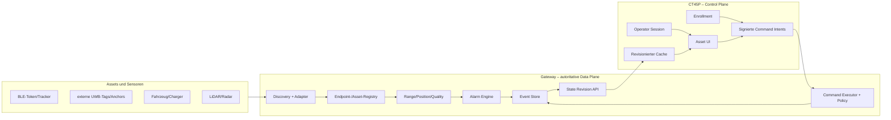

# CT45P-Geräteverwaltung und Interaktionsplattform

**Status:** belastbare Zielkonzeption, kein Nachweis einer fertigen Implementierung<br>
**Stand:** 2026-08-13<br>
**Architekturentscheidung:** [geteilte Control-/Data-Plane](ALTERNATIVE_IMPLEMENTATIONS.md)<br>
**Technische Basis:** [CT45P-Master-Detailarchitektur](CT45P_MASTER_ARCHITECTURE.md)<br>
**Alarm-Detailspezifikation:** [dauerhafter Hintergrund-Abstandsalarm](BACKGROUND_DISTANCE_ALARM.md)

## Kurzentscheidung

Die vorgeschlagene Geräteübersicht ist als Bedienkonzept sinnvoll, der gelieferte
Flutter-Blueprint ist jedoch weder eine Implementierung im vorhandenen
Repository noch eine belastbare Grundlage für Distanz- oder
Sicherheitsentscheidungen.

Für dieses Repository gilt deshalb:

- Die App bleibt zunächst **nativ in Kotlin/Android Views**. Ein paralleler
  Flutter-/Dart-Stack würde Buildsystem, Lifecycle, BLE-/USB-Integration und
  Datenmodelle unnötig verdoppeln.
- Der **CT45P ist Control Plane** für Bedienersitzung, Auswahl, Enrollment,
  signierte Konfigurationsabsicht und mobile Darstellung.
- Das **Linux-Gateway ist Data Plane** und autoritativ für beobachtete Geräte,
  Messwerte, Distanz-/Positionsschätzungen, Qualitätswerte, Alarmzustände und
  angewendete Konfiguration.
- Eine BLE-RSSI-Angabe ist eine **grobe, kalibrierungsabhängige
  Entfernungsschätzung**, keine „exakte Distanz“.
- Eine radiale Entfernung ist keine 2D-Position. Ohne gemessenen Winkel oder
  mehrere geometrisch bekannte Anchors darf die UI **keinen erfundenen Winkel**
  darstellen.
- „Erkannt“, „enrollt“, „online“, „markiert“ und „Alarm“ sind unabhängige
  Zustandsdimensionen und dürfen nicht in einem einzigen Enum konkurrieren.
- Ein Nutzer darf keinen „SIL-Level“ an einem Gerät auswählen. Funktionale
  Sicherheit ist eine Eigenschaft des freigegebenen Gesamtsystems; für die
  Plattform werden stattdessen Assurance-Klasse, Rolle, Policy und
  Operationsrisiko verwendet.

Das Ziel ist keine Liste mit möglichst vielen grünen Haken, sondern eine
Geräteverwaltung, die jederzeit unterscheidbar macht:

1. **Was wurde tatsächlich beobachtet?**
2. **Welcher Identität wird vertraut?**
3. **Welche Messqualität liegt vor?**
4. **Welche Aktion ist erlaubt?**
5. **Welcher Zustand ist aktuell, stale oder unbekannt?**

---

## 1. Bewertung des gelieferten Blueprints

### 1.1 Übernehmbare Produktideen

| Idee | Bewertung | Übernahme |
|---|---|---|
| Geräteübersicht mit Typ-Icon | sinnvoll | ja, mit Material-Icons und Textlabel |
| Suche und Filter | sinnvoll | ja, nach Typ, Enrollment, Verbindung, Health und Alarm |
| Detailansicht je Asset | sinnvoll | ja, mit Identität, Quellen, Messqualität und Audit |
| Markieren/Favorisieren | sinnvoll | ja, als rein lokaler UI-Zustand |
| manuelle Eintragung | bedingt sinnvoll | ja, aber als unaufgelöster Registry-Eintrag ohne behauptete Funkbindung |
| konfigurierbare Distanzalarme | sinnvoll | ja, qualitäts-, stale- und hystereseabhängig |
| Listen- und Kartenansicht | sinnvoll | ja, Karte nur bei beobachtbarer Position |
| capability-basierte Konfiguration | sinnvoll | ja, durch Gateway-Capabilities begrenzt |
| Offline-Anzeige | erforderlich | ja, als revisionierter Cache, nicht als zweite Source of Truth |

### 1.2 Nicht unverändert übernehmbare Aussagen

| Aussage/Mechanismus | Problem | Korrektur |
|---|---|---|
| „alle erkannten Geräte“ | Android und Gateway sehen nur freigegebene Protokolle, Scanfenster und berechtigte Endpunkte | „alle im aktuellen Scope beobachteten oder registrierten Assets“ |
| „exakte Distanz“ aus BLE-/Wi-Fi-RSSI | Multipath, Körperabschattung, Orientierung und Sendeleistungsstreuung dominieren | Schätzwert plus Methode, Alter, Konfidenz und Unsicherheit |
| UWB sei auf dem CT45P vorausgesetzt | öffentlich belegte CT45-XP-Ausstattung etabliert kein integriertes, app-zugängliches UWB | nur über ausgewählte externe UWB-Hardware oder bestätigte SKU-Capability |
| Position aus Distanz plus Hash der Geräte-ID | Hash ist kein gemessener Winkel | nur Distanzring oder „Richtung unbekannt“ anzeigen |
| drei BLE-Tokens ermöglichten Triangulation | für die Position eines Tokens sind mehrere räumlich bekannte Empfänger/Anchors erforderlich | Anchor-Geometrie und zeitlich zugeordnete Beobachtungen modellieren |
| LiDAR liefere Distanz zu einem identifizierten Asset | LiDAR liefert Geometrie/Rückstreuung, nicht automatisch eine Asset-ID | erst nach belastbarer Track-/Asset-Assoziation zuordnen |
| NFC liefere `0,05 m` | NFC-Nachweis ist ein Nahbereichsereignis, keine brauchbare Entfernungsmessung | `PROXIMITY_PRESENT`, keine metrische Distanz |
| auswählbarer SIL-Level | SIL kann nicht als Geräteattribut oder UI-Berechtigung vergeben werden | Assurance-Klasse und Policy-Ergebnis anzeigen, nicht editieren |
| MAC-Adresse als Asset-ID | BLE-Adressen können zufällig/rotierend sein; MAC ist kein Vertrauensanker | stabile Asset-ID/EID/Zertifikatsidentität; Adresse nur als Endpoint-Metadatum |
| statischer AES-GCM-Key und statischer IV | Nonce-Wiederverwendung bricht die Sicherheit von GCM | gerätespezifische Schlüssel, eindeutige Nonce/Sequenz, Replayfenster |
| Alarmprüfung mit Placeholder `0.0` | erzeugt stillschweigend falsche Normalzustände | fehlende Messung wird `UNKNOWN`/`DATA_LOSS`, niemals null Meter |
| Status „✅ implementiert“ | der Dart-Code ist nicht Teil des Kotlin-Projekts und enthält Platzhalter | erst nach Build-, Test- und Hardwareabnahme als implementiert markieren |

### 1.3 Sprach- und Frameworkentscheidung

Das vorhandene Projekt unter `android-app/` verwendet:

- Kotlin,
- AndroidX Fragments und XML-Layouts,
- ViewBinding,
- Room,
- Coroutines,
- OkHttp/Retrofit.

Es enthält weder Flutter noch Dart. Die fachlichen Ideen werden daher in native
Kotlin-Modelle, ViewModels, RecyclerView-Komponenten und XML-Layouts übersetzt.
Ein Flutter-Rewrite ist nur als eigene, später zu bewertende
Produktentscheidung zulässig; er ist keine Voraussetzung für die
Geräteverwaltung.

---

## 2. Systemgrenze und Autorität

### 2.1 Laufzeitverteilung



### 2.2 Eindeutige Zuständigkeiten

| Zustandsklasse | Autorität | CT45P-Verhalten |
|---|---|---|
| physisch beobachteter Endpoint | Gateway | Snapshot/Delta anzeigen |
| Messzeit, RSSI, ToF, Position, Kovarianz | Gateway | unverändert mit Qualitätsstatus anzeigen |
| Asset-/Endpoint-Assoziation | Gateway nach signierter Enrollment-Entscheidung | Enrollment-Intent erzeugen |
| Bedieneridentität und aktive Sitzung | CT45P | lokal prüfen und signierte Intents erzeugen |
| angewendete technische Konfiguration | Gateway | `requested`, `accepted`, `applied` oder `rejected` anzeigen |
| Distanzalarm-Laufzeitzustand | Gateway | lokale Benachrichtigung aus autoritativem Event spiegeln |
| Favorit, Auswahl, Sortierung | CT45P lokal | nicht zum Gateway replizieren, sofern nicht fachlich benötigt |
| Event-/Command-Audit | je Erzeuger, korreliert | nur als Cache/Ansicht halten |

Es gibt keine bidirektionale Tabellenreplikation. Das Gateway veröffentlicht
`state_revision`; der CT45P speichert daraus einen Cache. Änderungen erfolgen
als idempotente Commands und werden erst nach bestätigtem Gateway-State als
angewendet dargestellt.

---

## 3. Fachmodell

### 3.1 Asset ist nicht Endpoint

Ein physisches Asset kann mehrere Endpoints besitzen, und ein Endpoint ist nicht
immer sofort einem Asset zugeordnet.

```text
Asset
  asset_id                 stabile fachliche ID
  kind                     BATTERY_TOKEN, E_BIKE, CHARGER, ...
  display_name             freigegebener Anzeigename
  enrollment_state         UNENROLLED | PENDING | ENROLLED | REVOKED
  assurance_class          A0 | A1 | A2 | A3
  capabilities[]           deklarierte und verifizierte Fähigkeiten
  endpoint_refs[]          aktuell zugeordnete Funk-/Netzendpoints

Endpoint
  endpoint_id              Gateway-interne stabile Referenz
  transport                BLE | UWB | WIFI | USB | NFC | ETHERNET
  observed_address         optional, nicht als Identität verwenden
  protocol/profile         versionierter Decoder/GATT-Service
  identity_evidence        EID, Zertifikat, Herstellerdaten, Signaturstatus
  first_seen/last_seen      Messzeiten
  source_adapter_id        beobachtender Adapter
```

Ein manuell erfasstes Asset hat zunächst keinen Endpoint und den
Assoziationszustand `UNRESOLVED`. Es darf dadurch weder als online gelten noch
eine Entfernung von null Metern erhalten.

### 3.2 Orthogonale Zustandsdimensionen

Das vorgeschlagene `DeviceBindingStatus` vermischt Lebenszyklus,
Verbindungszustand, UI-Auswahl und Alarm. Das führt beispielsweise dazu, dass
ein „markiertes“ Gerät nicht mehr zugleich „gebunden“ sein kann.

Das Zielmodell trennt:

```text
DiscoveryState    OBSERVED | NOT_OBSERVED | UNSUPPORTED
EnrollmentState   UNENROLLED | PENDING | ENROLLED | REVOKED
Connectivity      ONLINE | STALE | OFFLINE | UNKNOWN
Health            HEALTHY | DEGRADED | FAULT | UNKNOWN
Trust             UNVERIFIED | VERIFIED | EXPIRED | REVOKED
AlarmCondition    NORMAL | PENDING_TRIGGER | ACTIVE | PENDING_CLEAR |
                  DATA_LOSS | DISABLED | ERROR
AlarmAttention    NONE | UNACKNOWLEDGED | ACKNOWLEDGED | SNOOZED
SelectionState    SELECTED | NOT_SELECTED       (nur lokale UI)
Favorite          true | false                  (nur lokale UI)
```

Die Card rendert diese Dimensionen priorisiert, ohne Informationen zu
überschreiben:

1. aktive kritische Alarme,
2. Trust-/Policy-Blockade,
3. Fault/Degraded,
4. stale/offline,
5. Enrollment,
6. normale Typfarbe.

### 3.3 Geräteklassen

Die Produktklassifikation darf die Messmethode nicht implizieren.

| Asset-Klasse | Typische Endpoints | Erlaubte Aussage |
|---|---|---|
| Batterie-Token | BLE Advertising/GATT, optional UWB | Identität, Batterie, Bewegung; Entfernung abhängig von Messquelle |
| E-Scooter/E-Bike/E-Roller/E-Quad | BLE, Wi-Fi, Diagnosegateway | registriertes Fahrzeugasset und freigegebene Telemetrie |
| UWB-Tracker | externer UWB-Endpoint | Range/Position nur mit ausgewähltem Anchor-/Ranging-System |
| Smart Tag | BLE-Herstellerprotokoll | nur nach Decoder-/Enrollment-Nachweis klassifizieren |
| Charger/Wallbox | Ethernet/Wi-Fi/BLE | Status/Commands nur über freigegebenes Herstellerprotokoll |
| Sensor | USB/Ethernet/BLE | Health und Datenquelle; nicht automatisch „zu ortendes Asset“ |
| Gateway | mTLS-Netzendpunkt | Data-Plane-Health, Revision und Capabilities |
| unbekannter Endpoint | beliebig | technische Beobachtung ohne behauptete Assetklasse |

Heuristiken anhand eines Gerätenamens dürfen eine UI-Vermutung erzeugen, aber
keine Enrollment-, Trust- oder Command-Berechtigung.

---

## 4. Entfernung, Position und Qualität

### 4.1 Darstellung eines RangeEstimate

Jeder Distanzwert braucht mindestens:

```text
RangeEstimate
  target_asset_id
  value_m                    nullable
  method                     BLE_RSSI | UWB_TOF | ...
  status                     VALID | LOW_CONFIDENCE | STALE |
                             UNOBSERVABLE | UNSUPPORTED | INVALID
  confidence                 0..1
  standard_deviation_m       optional
  lower_95_m / upper_95_m    optional
  observed_at
  age_ms
  source_ids[]
  calibration_id             optional
  quality_flags[]            NLOS_POSSIBLE, UNCALIBRATED, ...
```

Die UI zeigt beispielsweise:

```text
ca. 6,4 m · BLE-RSSI · geringe Qualität · vor 1,2 s
95-%-Intervall: 3,8–11,1 m · unkalibriert
```

und nicht nur `6,4 m`.

### 4.2 Methoden und zulässige Semantik

| Methode | UI-Semantik | Verbotene Schlussfolgerung |
|---|---|---|
| BLE-RSSI | grobe Nähe-/Entfernungsklasse nach Kalibrierung | „exakt“, Winkel oder XY-Position aus einem Empfänger |
| Wi-Fi-RSSI | grobe Link-/Näheinformation, falls API/Endpoint verfügbar | universelle Ortung aller Wi-Fi-Geräte |
| externes UWB-ToF/TDoA | Range/Position plus vom System gelieferte Qualität | CT45P-interne UWB-Fähigkeit voraussetzen |
| NFC | physische Nahbereichsinteraktion | metrische Distanz berechnen |
| LiDAR | Range zu geometrischem Return/Track | Assetidentität ohne Assoziation behaupten |
| BLE AoA/AoD | Winkel nur mit dokumentiertem CTE-/Antennenarray-System | aus Bluetooth-5.1-Version allein AoA-Unterstützung ableiten |
| manuell | deklarierter Standort | als Live-Messung darstellen |

### 4.3 BLE-RSSI

Das Log-Distance-Modell kann als grobe Schätzung genutzt werden:

```text
d = d0 · 10 ^ ((RSSI(d0) - RSSI) / (10 n))
```

Es ist nur unter dokumentierter Kalibrierung sinnvoll. Produktionslogik benötigt:

- Kalibrierprofil je Token-/Gehäusetyp und Zone,
- robuste Filterung statt unkritischem Mittelwert,
- Kennzeichnung von Orientierung und Körperabschattung im Testdatensatz,
- Ausreißer-/Sprungbegrenzung,
- Alter und Paketdichte,
- Konfidenz beziehungsweise Varianz,
- Ground-Truth-Abnahme für jede relevante Umgebung.

Die UI darf alternativ nur Klassen wie `NAH`, `MITTEL`, `FERN`, `UNBEKANNT`
anzeigen, wenn ein metrischer Wert nicht stabil validiert ist.

### 4.4 Multilateration

Für die Position eines bewegten Tokens sind mindestens drei geometrisch
geeignete, bekannte Anchors für 2D beziehungsweise vier für grundsätzlich
beobachtbares 3D nötig. Zusätzliche Messungen verbessern Robustheit, garantieren
aber keine gute Geometrie.

Die Lösung muss ausgeben:

- verwendete Anchor-IDs und Positionen,
- 2D-/3D-Modus,
- Residuen,
- Konditions-/Geometriemaß,
- Kovarianz,
- NLOS-/Outlier-Flags,
- Kalibrierungs-ID.

Bei degenerierter Geometrie lautet das Ergebnis `UNOBSERVABLE`, nicht
`Position.zero`.

### 4.5 Kartenansicht

Die Karte hat drei explizite Darstellungsmodi:

1. **Position verfügbar:** Punkt/Ellipse im angegebenen Koordinatenframe;
   Konfidenzellipse und Alter werden sichtbar.
2. **Nur Range verfügbar:** Ring beziehungsweise Listeneintrag „Richtung
   unbekannt“; keine zufällige XY-Position.
3. **Keine aktuelle Messung:** letzte Position gestrichelt mit Zeitangabe oder
   Asset nur in der Liste.

Alle Positionen müssen einen `frame_id` tragen. Gateway-Karte, Gebäudeplan und
Assetposition werden nur nach bekannter Transformation kombiniert.

---

## 5. Alarmmodell

### 5.1 AlarmPolicy

Ein produktiver Distanzalarm besteht nicht nur aus einem Schwellwert:

```text
AlarmPolicy
  policy_id, asset_id, revision, enabled
  metric                     RANGE_FROM_CT45P | RANGE_FROM_ANCHOR |
                             RANGE_FROM_ZONE | GEOFENCE_EXIT |
                             CONNECTIVITY_LOSS
  reference_id               bei Anchor-, Zone- oder Geofence-Bezug
  threshold_m                nur bei Range-Alarm
  trigger_direction          ABOVE | BELOW | OUTSIDE | LOSS
  decision_mode              POSSIBLE_BREACH | CONFIRMED_BREACH
  minimum_confidence
  maximum_age_ms
  dwell_ms, clear_dwell_ms
  data_loss_dwell_ms, recovery_dwell_ms
  hysteresis_m
  cooldown_ms                nur für Wiederholungszustellung
  severity                   INFO | WARNING | CRITICAL
  data_loss_behavior
  delivery_profile_id
```

Die maschinenlesbare Form steht unter
[`contracts/alarm-policy.schema.json`](contracts/alarm-policy.schema.json).
`POSSIBLE_BREACH` kann bei Überschneidung des Unsicherheitsintervalls früh
warnen. `CONFIRMED_BREACH` löst erst aus, wenn auch die toleranzbereinigte
Untergrenze außerhalb liegt. Welche Variante gilt, ist eine fachliche
Policyentscheidung.

### 5.2 Zustandsautomat

Die Runtime trennt den physischen/technischen **Bedingungszustand**

```text
NORMAL | PENDING_TRIGGER | ACTIVE | PENDING_CLEAR |
DATA_LOSS | DISABLED | ERROR
```

vom **Aufmerksamkeitszustand**

```text
NONE | UNACKNOWLEDGED | ACKNOWLEDGED | SNOOZED
```

Damit bleibt eine Distanzverletzung `ACTIVE`, auch wenn ein Operator sie
quittiert oder die Wiederholungszustellung zeitlich stummschaltet. Entwarnung
entsteht nur aus gültiger Evidence, Hysterese und `clear_dwell_ms`. Datenverlust
ist ein eigener technischer Zustand und darf nicht als `distance = 0` oder als
sichere Distanz interpretiert werden. Der vollständige Zustandsautomat,
Recovery- und Outbox-Ablauf steht im
[Hintergrund-Abstandsalarm](BACKGROUND_DISTANCE_ALARM.md); die aktuelle
Projektion folgt
[`contracts/alarm-runtime.schema.json`](contracts/alarm-runtime.schema.json),
unveränderliche Übergänge folgen
[`contracts/alarm-event.schema.json`](contracts/alarm-event.schema.json).

### 5.3 Ausführungsort

Die autoritative Alarm Engine läuft auf dem Gateway, weil dort die Messungen
entstehen und Alarme auch bei gesperrter oder getrennter CT45P-App bewertet
werden müssen. Der CT45P:

- übermittelt eine signierte Policyänderung,
- zeigt den bestätigten `policy_revision`-Stand,
- empfängt Alarmereignisse,
- erzeugt lokale visuelle/akustische Benachrichtigungen,
- zeigt stale/offline klar an.

Für zeitkritische oder sicherheitsbezogene Alarme ist eine Android-Notification
allein kein freigegebener Aktor.

---

## 6. Enrollment, Bindung und Identität

### 6.1 Begriffe

- **beobachtet:** ein Adapter hat einen Endpoint gesehen;
- **registriert:** ein fachlicher Assetdatensatz existiert;
- **assoziiert:** Endpoint und Asset wurden nachvollziehbar verknüpft;
- **BLE-bonded:** Bluetooth-Schlüsselbeziehung; nicht gleich Asset-Enrollment;
- **enrollt:** Identität, Scope und Policy wurden autorisiert;
- **online:** aktuelle Health-/Heartbeat-Kriterien sind erfüllt.

Der UI-Button sollte deshalb „Enroll/Zuordnen“ und nicht pauschal „Binden“
heißen. Bei Bluetooth-Bonding wird dies als eigener technischer Schritt
angezeigt.

### 6.2 Enrollment-Ablauf

```text
1. Gateway meldet unzugeordneten Endpoint mit Identity Evidence.
2. CT45P zeigt Typvermutung, Quelle und Vertrauensstatus.
3. Operator prüft physische Zuordnung, z. B. NFC/QR/Proof-of-Possession.
4. CT45P erzeugt signierten Enrollment-Intent mit Ablaufzeit.
5. Gateway prüft Signatur, Rolle, Audience, Replay-ID und lokale Policy.
6. Gateway assoziiert Asset und Endpoint transaktional.
7. Neue State Revision bestätigt ENROLLED oder liefert einen Fehlercode.
```

Ein Anzeigename oder eine eingegebene MAC-Adresse ist kein
Proof-of-Possession.

---

## 7. Gerätekonfiguration und Commands

### 7.1 Capability-getriebene Oberfläche

Konfigurationsfelder werden nicht aus der Assetklasse geraten, sondern aus
versionierten Gateway-Capabilities erzeugt. Beispiele:

- `telemetry.sample_rate.read/write`,
- `ble.advertising_profile.read`,
- `alarm.range_policy.write`,
- `charger.session.stop`,
- `firmware.update.request`.

Jede Capability enthält Typ, erlaubten Wertebereich, Einheit,
Operationsrisiko, erforderliche Rolle und gegebenenfalls physische
Bestätigungspflicht.

### 7.2 Kein frei editierbares SIL

Anstelle eines SIL-Dropdowns zeigt die UI:

```text
Assurance: A2
Operation: charger.session.stop
Policy: erlaubt nach erneuter Bedienerauthentisierung
Nachweis: Gateway-Zertifikat gültig, Asset enrollt, State aktuell
```

Die Assurance-Klasse ist Ergebnis des Provisioning-/Freigabeprozesses und nicht
über einen allgemeinen Konfigurationsdialog änderbar.

### 7.3 Command-Lifecycle

```text
DRAFT → SIGNED → SENT → ACCEPTED → EXECUTING → COMPLETED
                    ├→ REJECTED
                    ├→ CONFLICT
                    └→ EXPIRED
```

Jeder Command besitzt:

- `command_id`,
- Actor-/Session-ID,
- Gateway-Audience,
- Resource und Action,
- `expected_revision`,
- `issued_at` und kurze `expires_at`,
- typisierte Parameter,
- Policy-Version,
- Signatur.

Der Vertrag ist in
[`contracts/command-intent.schema.json`](contracts/command-intent.schema.json)
formalisiert. Nach einem Reconnect wird der Status derselben Command-ID
abgefragt; ein abgelaufener Command wird nicht neu ausgeführt.

### 7.4 Diagnose- und UDS-Grenze

Ein generisches UI darf keine OEM-Seed-Key-Algorithmen oder frei wählbare
„Engineering“-Freigaben enthalten. UDS Security Access ist nur zulässig, wenn:

- OEM-Protokoll und Schlüsselverwaltung vertraglich geklärt sind,
- der Adapter eine freigegebene Capability meldet,
- Rollen-/Fahrzeug-/Sitzungspolicy erfüllt ist,
- Rate-Limits und ECU-Delay eingehalten werden,
- jeder Versuch auditiert wird,
- Fehler nicht durch blindes Retry bis zur ECU-Sperre verschärft werden.

---

## 8. UI-Informationsarchitektur

### 8.1 Dashboard

Der Einstieg zeigt:

- Gateway-Verbindung und letzte `state_revision`,
- Architekturmodus (`GATEWAY`, `ANDROID_DEMO`),
- Anzahl online/stale/offline,
- aktive Alarme nach Severity,
- nicht enrollte beobachtete Endpoints,
- blockierte beziehungsweise degradierte Quellen,
- Suchfeld und Filterchips.

Die UI darf bei Gateway-Verlust nicht einfach die letzte Liste als live
weiterführen. Ein persistenter Banner zeigt „Offline – Stand von …“.

### 8.2 Asset-Card

Mindestinhalt:

```text
[Typ-Icon] Anzeigename                  [Alarm/Health]
           Assettyp · Enrollment
           ca. 6,4 m · BLE · LOW · 1,2 s alt
           Gateway 01 · Endpoint …7A2F
           [Details] [Markieren] [Aktionen]
```

Regeln:

- Icon wird immer durch Text ergänzt; Farbe allein trägt keine Bedeutung.
- Unbekannte/stale Werte werden als `–` beziehungsweise „unbekannt“ angezeigt,
  nie als `0,0 m`.
- Konfidenz-/Stale-Status ist direkt sichtbar.
- Kritische Aktionen liegen nicht als ungeschützter Schnellbutton auf der Card.
- Rot/Grün-Kontraste und Touchziele werden auf dem 5-Zoll-Display geprüft.

### 8.3 Detailansicht

Tabs oder Abschnitte:

1. **Übersicht:** Identität, Statusdimensionen, letzte Beobachtung.
2. **Ortung:** Methode, Verlauf, Unsicherheit, Quellen, Kalibrierung.
3. **Telemetrie:** capability-basierte, einheitenbehaftete Werte.
4. **Alarme:** Policy, Laufzeitzustand, Historie, Quittierungen.
5. **Konfiguration:** gewünschter und angewendeter Wert mit Revision.
6. **Audit:** Enrollment, Commands, Fehler und Actor-Korrelation.

### 8.4 Karten-/Näheansicht

- 2D-Punkte nur für gültige Positionen in kompatiblem Frame.
- Konfidenzellipse statt scheinpräzisem Punkt.
- Range-only-Assets in separater Liste oder als Ring.
- Stale Position gestrichelt und mit Alter.
- Demo-/simulierte Daten dauerhaft mit `SIMULATED` kennzeichnen.
- Kartenmaßstab basiert auf realem Frame, nicht auf einer fixen
  Pixel-zu-Meter-Annahme ohne Viewport-Transformation.

### 8.5 Icons

Empfohlene native Android-Icons:

| Assettyp | Material-Symbol | Semantische Farbe |
|---|---|---|
| Batterie-Token | `battery_full` | Grün nur bei gesundem Batteriestatus |
| E-Scooter | `electric_scooter` | Produktakzent |
| E-Bike | `pedal_bike` | Produktakzent |
| Roller/Quad | `two_wheeler` / `directions_car` | Produktakzent |
| Sensor | `sensors` | Cyan |
| UWB-Tracker | `location_on` | Magenta |
| Charger | `ev_station` | Grün/Blau |
| Gateway | `router` | Blau |
| unbekannt | `device_unknown` | Grau |

Typfarbe, Healthfarbe und Alarmfarbe sind getrennte visuelle Ebenen. Ein rotes
Fahrzeugtyp-Icon darf nicht wie ein aktiver Alarm wirken.

---

## 9. API- und Sync-Modell

### 9.1 State-Snapshot

Das Gateway liefert revisionierte Projektionen. Ein exemplarischer Ausschnitt:

```json
{
  "schema_version": "1.0.0",
  "state_revision": 1042,
  "generated_at": "2026-08-13T14:15:30Z",
  "gateway_id": "gateway-01",
  "assets": [
    {
      "asset_id": "battery-token-17",
      "kind": "BATTERY_TOKEN",
      "display_name": "Akku 17",
      "enrollment_state": "ENROLLED",
      "connectivity": "ONLINE",
      "health": "HEALTHY",
      "trust": "VERIFIED",
      "last_observed_at": "2026-08-13T14:15:29.400Z",
      "range": {
        "method": "BLE_RSSI",
        "status": "LOW_CONFIDENCE",
        "value_m": 6.4,
        "confidence": 0.42,
        "lower_95_m": 3.8,
        "upper_95_m": 11.1,
        "quality_flags": ["UNCALIBRATED"]
      },
      "active_alarm_ids": []
    }
  ]
}
```

Das zugehörige Einzelasset-Schema steht unter
[`contracts/asset-state.schema.json`](contracts/asset-state.schema.json).

### 9.2 Delta und Reconnect

```text
CT45P → Hello(last_state_revision=1039, pending_command_ids=[...])
Gateway → Delta(from=1039, to=1042) | Snapshot(required=true)
CT45P → CommandStatusQuery(ids=[...])
Gateway → CommandStatuses(...)
```

Deltas werden strikt in Reihenfolge angewendet. Bei Lücke, unbekannter Revision
oder Schema-Inkompatibilität verwirft die App nicht einzelne Felder, sondern
fordert einen Snapshot an.

### 9.3 Lokaler Cache

Room speichert:

- letzten konsistenten Snapshot beziehungsweise normalisierte Projektion,
- `state_revision` und Erzeugungszeit,
- lokale Favoriten/Sortierung,
- ausstehende Command-IDs und ihren letzten bekannten Status,
- keine Klartextschlüssel oder OEM-Secrets.

Der Cache wird in der UI immer mit Alter und Onlinezustand verbunden. Er darf
keine eigene Entfernung oder Gateway-Konfiguration fortschreiben.

---

## 10. Native Android-Zielstruktur

```text
com.example.agent
├── asset/
│   ├── domain/
│   │   ├── Asset.kt
│   │   ├── AssetStatus.kt
│   │   ├── RangeEstimate.kt
│   │   ├── AlarmPolicy.kt
│   │   └── CommandIntent.kt
│   ├── data/
│   │   ├── AssetStateApi.kt
│   │   ├── AssetDeltaReducer.kt
│   │   ├── AssetCacheDao.kt
│   │   └── AssetRepository.kt
│   └── presentation/
│       ├── list/AssetListFragment.kt
│       ├── list/AssetListViewModel.kt
│       ├── detail/AssetDetailFragment.kt
│       ├── map/AssetMapFragment.kt
│       └── alarm/AlarmPolicyDialog.kt
├── identity/
│   ├── EnrollmentCoordinator.kt
│   └── CommandSigner.kt
├── gateway/
│   ├── GatewaySession.kt
│   ├── RevisionClient.kt
│   └── GatewayHealth.kt
└── demo/
    └── DemoAssetSource.kt
```

### 10.1 Abhängigkeitsregeln

- Domainmodelle importieren keine Android-, BLE-, USB-, Retrofit- oder
  Room-Klassen.
- UI arbeitet nur mit immutable ViewState/StateFlow.
- `AssetRepository` vereinigt Gateway-State und lokalen UI-Cache, erzeugt aber
  keine simulierten Messwerte.
- Enrollment/Commands laufen über eigene Use Cases und nicht direkt aus einem
  Fragment zum Funkadapter.
- Direkte Sensoren in der Android-App sind ausschließlich im sichtbaren
  `ANDROID_DEMO`-Flavor zulässig.

### 10.2 Keine ungeprüfte Frameworkmigration

Für die erste Iteration werden RecyclerView, Material Components, Fragments,
ViewModel und StateFlow verwendet. Jetpack Compose wäre technisch möglich, ist
aber eine separate UI-Migration. Flutter wird nicht nur für einzelne Screens in
die bestehende App eingebettet.

---

## 11. Abbildung auf den aktuellen Code

| Aktueller Pfad | Befund | Zielmaßnahme |
|---|---|---|
| `MainActivity.kt` | konstruiert Sensoren, EKF, DB und Netzwerk direkt | Composition Root/ViewModels; Produktionsmodus ohne direkte Fusion |
| `network/ClientModels.kt` | technische Clients, API-Key/JWT-Secret im Laufzeitmodell | Asset/Endpoint trennen; Credential-Referenzen statt Secret-Feldern |
| `network/ClientRegistry.kt` | flüchtige In-Memory-Liste, kein revisionierter State | Gateway-Registry/Event Store; Android nur Cache |
| `sensors/BleTokenManager.kt` | Token-spezifischer Scan, kein allgemeines Enrollment | versionierter Endpoint-Decoder und Identity Evidence |
| `offline/OpenHPSAdapter.kt` | einfache RSSI-Distanz/WLS | Gateway-Schätzer mit Kalibrierung, Kovarianz und Beobachtbarkeitsprüfung |
| `ui/map/MapRenderer.kt` | Richtung aus MAC-Hash, Distanz aus fixem RSSI-Modell | erfundene Winkel entfernen; Range-only/Position-Modi |
| `ui/map/MapFragment.kt` | einmaliges Canvas-Zeichnen ohne reaktiven State | ViewModel/StateFlow, Lifecycle-aware Rendering |
| `AgentApiClient.kt` | hart codierte Klartext-IP | Enrollment/Discovery und mTLS-Endpunkt |
| `AgentWebSocketClient.kt` | kein revisionierter Resume/Outbox | Hello/Delta/Snapshot und idempotenter Commandstatus |
| `storage/*` | speichert Fusionstransformen | Asset-Cache, Revision und Pending-Command-Metadaten ergänzen |

Der vorhandene `MapRenderer` stellt aktuell BLE-Tokens unter einem aus dem
MAC-Hash berechneten Winkel dar. Diese Anzeige ist demonstrativ, aber fachlich
falsch und darf im Produktionsmodus nicht als Standortkarte erscheinen.

---

## 12. Stufenweiser Implementierungsplan

### Phase 0 – Terminologie und Demo-Grenze

- UI-Texte „exakt“, „Triangulation“ und „implementiert“ korrigieren.
- Architekturmodus sichtbar machen.
- Hash-Winkel und synthetische Positionen aus dem Produktionspfad entfernen.
- Statusdimensionen und unbekannte Werte definieren.

**Done:** Kein Produktionsscreen zeigt simulierte Positionen ohne
`SIMULATED`-Kennzeichnung; unbekannte Distanz wird nicht als null dargestellt.

### Phase 1 – Verträge und reine Domainmodelle

- `asset-state` und `command-intent` versionieren.
- Kotlin-Domainmodelle und Delta-Reducer ohne Android-Abhängigkeit erstellen.
- Golden JSON Fixtures und Schema-/Reducer-Tests ergänzen.
- Endpoint-/Asset-/Enrollment-Begriffe im Gateway vereinheitlichen.

**Done:** Snapshot, Delta-Lücke, unbekannte Enumwerte, stale State und
Schemafehler sind automatisiert getestet.

### Phase 2 – Read-only Asset-Dashboard

- Gateway-State-API und mTLS-Session anbinden.
- Assetliste, Filter, Statusbadges und Detailübersicht nativ implementieren.
- Room-Cache mit Revisions- und Altersanzeige.
- Accessibility und 5-Zoll-Layout testen.

**Done:** App-Neustart und Netzverlust zeigen konsistent den letzten Stand mit
Alter; Snapshot/Delta konvergieren auf denselben State.

### Phase 3 – Messqualität und Karte

- RangeEstimate/PositionEstimate vollständig übertragen.
- Range-only-, Position-, stale- und unobservable-Modus implementieren.
- Konfidenzintervalle und Datenquellen sichtbar machen.
- Ground-Truth-Ergebnisse in Abnahmetests verwenden.

**Done:** Kein XY-Punkt entsteht ohne gemessene/beobachtbare Position; Frame- und
Kovarianzfehler werden sichtbar abgelehnt.

### Phase 4 – Enrollment und Konfiguration

- QR/NFC/Proof-of-Possession-Enrollment.
- Keystore-gestützte Command-Signatur.
- capability-basierte Formulare.
- `expected_revision`, Ablaufzeit, Idempotenz und Audit.

**Done:** Replay, abgelaufener Command, falsche Audience, Revisionkonflikt und
unzureichende Rolle werden reproduzierbar abgelehnt.

### Phase 5 – Alarme

- AlarmPolicy und Gateway-Alarmzustandsautomat.
- Hysterese, Dwell, Confidence und Data-Loss-Regeln.
- Android-Notifications als Spiegelung autoritativer Events.
- Alarmhistorie und Quittierung.

**Done:** Schwellenflattern, stale Messung, NLOS-Ausreißer, Gateway-Verlust und
Reconnect erzeugen die spezifizierten Zustände ohne Alarmsturm.

### Phase 6 – Feldfreigabe

- reale SKU, Gateway, Token, Anchors und Zonen testen,
- RF-/NLOS-/Körperabschattungsdatensatz,
- Performance, Akku und thermisches Verhalten,
- Threat Model, Datenschutz und Operationsfreigabe,
- Bedienertests mit Handschuhen und schlechter Sicht.

**Done:** dokumentierte P50/P95-Fehler, Verfügbarkeit, Alarm-Fehlerraten,
Reconnectzeit und Sicherheitsprüfungen erfüllen die freigegebenen Grenzwerte.

---

## 13. Abnahmekriterien

1. **Framework:** Kein nicht gebauter Dart-/Flutter-Code wird als Android-Funktion
   ausgewiesen.
2. **Identität:** Asset-ID ist von beobachteter MAC-/Funkadresse getrennt.
3. **Status:** Enrollment, Verbindung, Health, Alarm und Auswahl sind orthogonal.
4. **Unbekannt:** Fehlende Messungen erscheinen niemals als `0 m`, `Position.zero`
   oder „gesund“.
5. **Range:** Jeder metrische Wert zeigt Methode, Alter und Qualitätsstatus.
6. **Position:** Kein Winkel/XY-Wert wird aus Geräte-ID, MAC oder Listenindex
   erzeugt.
7. **UWB/AoA:** Die UI meldet diese Fähigkeiten nur nach Runtime-Capability und
   ausgewählter externer Hardware.
8. **Alarm:** Hysterese, Dwell, Datenalter, Mindestkonfidenz und Data-Loss sind
   getestet.
9. **Config:** UI zeigt requested/applied getrennt; Gateway bleibt für den
   angewendeten Zustand autoritativ.
10. **Security:** Commands sind signiert, kurzlebig, audience-gebunden,
    revisionsgeprüft und idempotent.
11. **Safety:** Es existiert kein frei editierbarer SIL-Level; kritische Aktionen
    folgen freigegebener Policy und Step-up-Authentisierung.
12. **Offline:** Cachezustand ist klar als stale/offline markiert; keine
    zeitkritischen Commands werden nach Ablauf nachgesendet.
13. **Accessibility:** Farbe ist nie der einzige Informationsträger; TalkBack,
    Kontrast und Touchziele sind geprüft.
14. **Audit:** Enrollment, Policyänderung, Command und Alarmquittierung besitzen
    Actor-, Zeit-, Geräte- und Correlation-Bezug.
15. **Ground Truth:** Distanz-/Positionsqualität wird je Technologie und Zone
    gegen Referenzmessungen dokumentiert.

---

## 14. Produktentscheidung

Die Geräteverwaltung soll umgesetzt werden, aber nicht als ungeprüfte
„vollständige Integrationsfähigkeit“ des CT45P und nicht als parallele
Flutter-Demo. Das belastbare Ziel ist eine **native CT45P-Control-Plane**, die
autoritative, qualitätsbehaftete Assetzustände des Gateways darstellt und
sichere Benutzerintentionen zurücksendet.

Die erste sinnvolle Softwarelieferung ist ein **read-only, revisioniertes
Asset-Dashboard**. Erst wenn Identität, State-Resume und Qualitätssemantik
funktionieren, folgen Enrollment, Konfiguration und Alarmierung. Damit wird
verhindert, dass eine attraktive UI erfundene Positionen oder unbestätigte
Sicherheitszustände als Fakten präsentiert.
